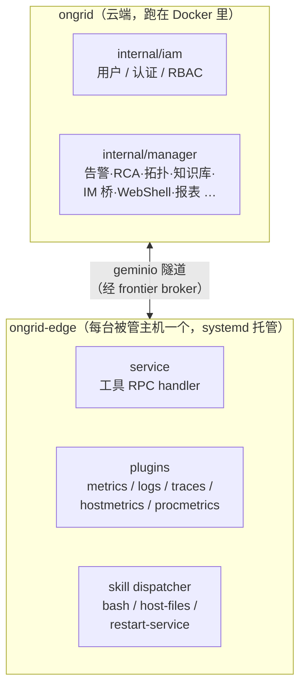

# 01 · 项目概览

## Ongrid 是什么

Ongrid 是一个**自托管的运维 AI Agent 平台**。一条命令在自己的服务器上装好全栈
（`install.sh`），把被管主机接进来之后，它能：

- **回答运维问题**——在 Slack / Telegram / 飞书 / 钉钉 / 企微或 Web 聊天里直接问
  「db-3 为什么内存飙了」，agent 自己写 PromQL / LogQL / TraceQL 去查；
- **告警自动排查**——告警触发后 investigator 自动 spawn 一个 RCA worker，
  顺因果链溯源到根因（"0 号病人"），把结论写回聊天频道；
- **根因分析（RCA）**——结合拓扑爆炸半径、指标 / 日志 / 链路关联，
  最终能把"为什么"定位到一行源代码；
- **远程诊断与执行**——只读 bash 沙箱 + 26+ 巡检工具 + 浏览器 SSH（反向隧道 WebShell），
  全程审计；
- **知识与代码检索（RAG）**——接入文档库和代码仓库，向量化后供 agent 引用。

## 核心设计取向

| 取向 | 含义 |
|------|------|
| **自托管、零入站** | 全栈跑在用户自己的服务器上；被管主机不开任何入站端口，edge 出向拨号 |
| **自带可观测性** | 安装包内置 Prometheus + Loki + Tempo + Grafana，开箱即有 m/l/t 三件套 |
| **模型可插拔** | Anthropic / OpenAI / GLM / DeepSeek / Gemini / Kimi 热路由，不绑定单一厂商 |
| **审计优先** | 所有主机侧工具调用、WebShell 会话都有审计记录 |
| **单服务 monorepo** | 云端是一个进程（`cmd/ongrid`），内部按 Bounded Context 划界，不搞微服务 |

## 双进程模型

整个系统只有两个自研二进制：

- **`cmd/ongrid`**（云端）：装配 `iam` + `manager` 两个 BC。HTTP API（chi，`:8080`）、
  agent 内核、告警评估、IM 桥、隧道服务端都在这一个进程里。
  cgo 链接（本地 ONNX 嵌入模型需要 glibc），镜像是 `debian:bookworm-slim`。
- **`cmd/ongrid-edge`**（边端）：装配 `edgeagent` BC。纯 Go（`CGO_ENABLED=0`），
  distroless 静态镜像 / 裸二进制皆可跑。负责：
  - 通过 frontier broker 与云端建立**出向**隧道（geminio 协议，云端监听 `:40012`）；
  - 响应云端下发的工具 RPC（`get_host_load`、`host_files`、`execute_skill` …）；
  - 托管随包分发的采集器：promtail（日志→Loki）、otelcol-contrib（链路→Tempo）、
    node_exporter / process-exporter（主机与进程指标）；
  - 反向隧道 WebShell（浏览器 SSH）。

## 主要功能与对应代码入口

| 功能 | Web 路由 | 后端子域 |
|------|----------|----------|
| AI 聊天 / agent 会话 | `/`、`/chat/:sessionId` | `internal/manager/biz/aiops` |
| 设备（edge）管理 | `/devices`、`/devices/:edgeId` | `internal/manager/biz/edge`、`device` |
| 监控面板 | `/monitor`、`/dashboard` | `internal/manager/biz/monitor`、`metric` |
| 日志 / 链路查询 | `/logs`、`/traces` | `internal/pkg/logquery`、`tracequery` |
| 告警与规则 | `/alerts`、`/alerts/rules` | `internal/manager/biz/alert` |
| 拓扑与爆炸半径 | `/topology` | `internal/manager/biz/topology` |
| 知识库（RAG） | `/knowledge`、`/knowledge/repos` | `internal/manager/biz/knowledge` |
| Skill 市场与运行 | `/skills`、`/skills/:key` | `internal/manager/biz/skill`、`marketplace`、`internal/skill` |
| 浏览器 SSH | `/devices/:deviceId/shell` | `internal/manager/biz/webshell` + `internal/edgeagent/webshell` |
| 报表 | `/reports`、`/reports/schedules` | `internal/manager/biz/report` |
| IM 频道接入 | 设置页 | `internal/manager/biz/imbridge` |
| Agent / 子代理管理 | `/agents` | `internal/manager/biz/aiops` + `agents/*.md` 提示词 |

## 版本与发布形态

- 版本号唯一来源是根目录 `VERSION` 文件，注入到二进制（`-ldflags -X main.version=...`）。
- 对外交付物是**单个自包含 tarball**（`make package`）：内含 docker 镜像、
  edge 各平台二进制、采集器、安装脚本，scp 到任意装了 docker compose 的 Linux 机器即可
  `sudo ./install.sh`。详见 [07 部署与数据](./07-deploy-and-data.md)。
- 路线图见 [`ROADMAP.md`](../../ROADMAP.md)（RCA 深化、K8s / 云资源接入、HA 等）。
