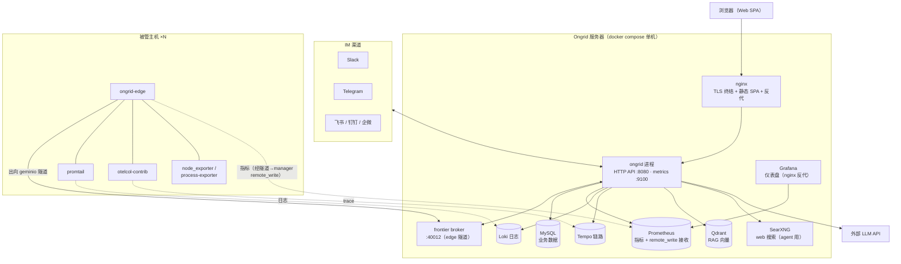
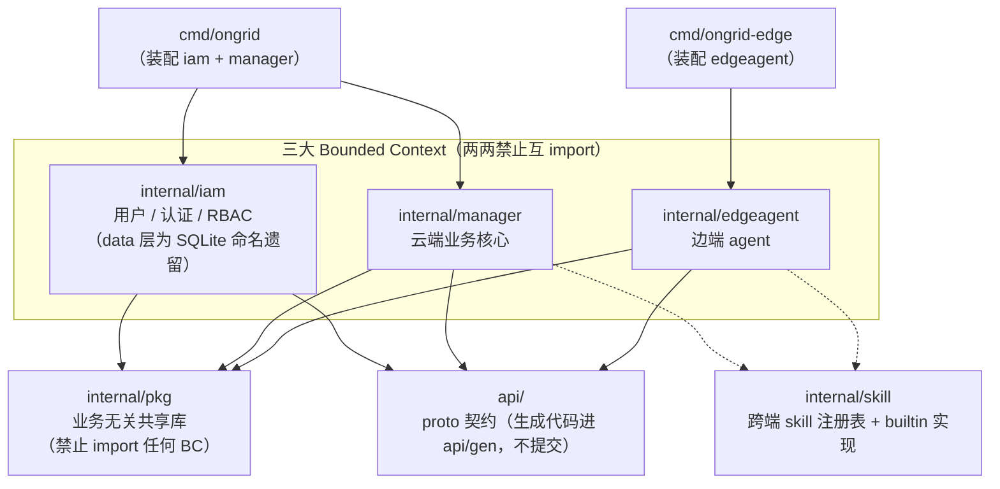
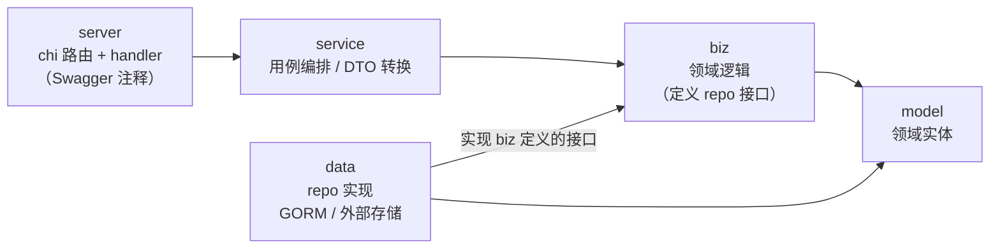
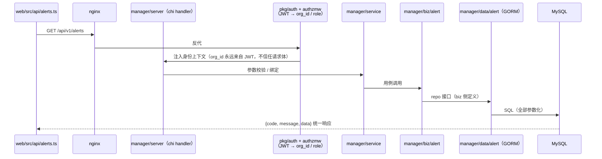
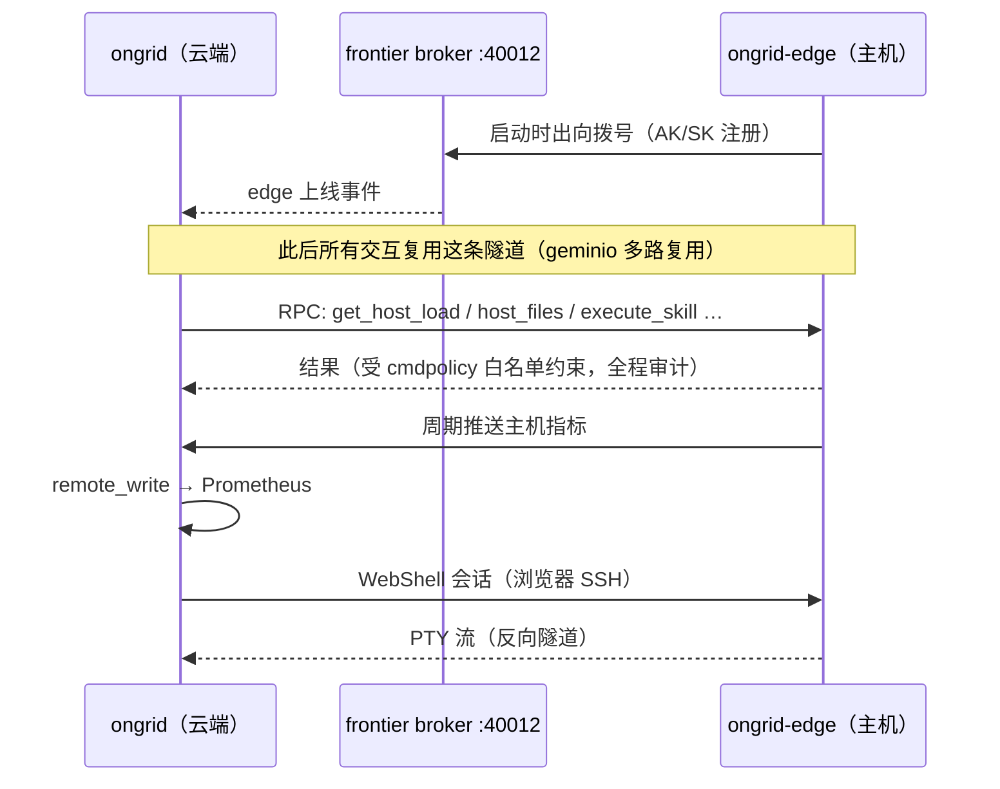

# 02 · 总体架构

## 系统拓扑



要点：

- **唯一对外入口是 nginx**（生产安装栈）；Prometheus / Grafana 不直接暴露，
  经 nginx 反代并复用 ongrid 的会话鉴权。
- **edge 与云端之间只有一条出向隧道**（geminio over frontier）。云端要在主机上
  执行工具 / 开 WebShell，都是把 RPC 推过这条已建立的隧道，而不是反过来连主机。
- agent 查询观测数据走的是 manager 内的查询封装
  （`internal/pkg/promquery` / `logquery` / `tracequery`），不是直连 Grafana。

## Bounded Context 划分（monorepo 红线）

`internal/` 下三大 BC **两两禁止互相 import**，跨 BC 只能通过 API、事件或
`internal/pkg/`（业务无关共享库）。该规则由 [`.go-arch-lint.yml`](../../.go-arch-lint.yml)
描述、`make arch-lint` 强制、CODEOWNERS 兜底。



注意 `cmd/ongrid-edge` **绝不允许** `import iam / manager`——`go-arch-lint v3` 对 cmd
子目录无法原生表达这条，靠 review + CODEOWNERS 把守（见 `.go-arch-lint.yml` 注释）。

## BC 内分层

每个 BC 内部统一为五层，依赖方向单向向下，**接口在消费方定义**：



两条最容易踩的红线：

1. **service 不得直接 import 同 BC 的 data 层**——必须经 biz。arch-lint 会拦。
2. **依赖注入只走构造函数**，禁止全局可变变量；所有装配发生在 `cmd/*/main.go`。
   `cmd/ongrid/main.go` 是整个云端的 DI root（文件很大，按区块组织），
   新增子域时在这里 new repo → new biz → new service → 挂路由。

## 代码地图

```text
ongrid/
├── cmd/
│   ├── ongrid/            云端入口 + DI root（main.go 极大，是装配层不是业务层）
│   └── ongrid-edge/       边端入口
├── api/                   proto 契约（buf 管理；生成物 api/gen/ 不提交）
│   ├── iam/v1/            ongrid.iam.v1
│   ├── manager/{edge,metric,aiops}/v1/
│   └── tunnel/v1/         geminio 隧道载荷（不是 gRPC）
├── internal/
│   ├── iam/               server / service / biz / data / model
│   ├── manager/
│   │   ├── server/  service/  biz/  data/  model/
│   │   └── biz/{aiops, alert, audit, device, edge, grafana, imbridge,
│   │            knowledge, marketplace, metric, monitor, promwrite,
│   │            report, setting, skill, topology, webshell}
│   ├── edgeagent/
│   │   ├── service/  biz/  model/
│   │   ├── plugins/{metrics, logs, traces, hostmetrics, procmetrics}
│   │   ├── bash/  host_files/  restart_service/  webshell/  skill/
│   │   ├── collector/     主机指标采集（gopsutil scraper）
│   │   └── cmdpolicy/     命令白名单 / 安全策略
│   ├── skill/             skill 注册表 + builtin/（init() 注册执行器）
│   └── pkg/               业务无关共享库（llm, tunnel, promquery, logquery,
│                          tracequery, promwrite, embedding, qdrantx, notify,
│                          auth, authzmw, config, dbx, logger, httpserver, …）
├── agents/                coordinator 子代理的提示词（markdown + frontmatter）
├── skills/                内置 skill 定义（bash / host-files / restart-service）
├── web/                   React SPA（见 06）
├── deploy/                Dockerfile × 4、docker-compose.yml、安装栈资产
├── dist/                  release 打包脚本（package.sh 等）
├── tests/e2e/             E2E 测试（build tag: e2e，需 Docker）
└── docs/                  文档（install/ 运维、test/ 测试目录、dev/ 本文档）
```

## 一次 HTTP 请求的生命周期

以「前端拉取告警列表」为例：



对应约定：响应体统一 `{code, message, data}`；handler 必须有
`@Summary / @Router / @Success` Swagger 注释；`org_id` 永远不是用户可传字段
（ADR-003，见 `api/README.md`）。

## 云端 ↔ 边端通信



- frontier 是上游开源 broker（`singchia/frontier`，ADR-007），release 时从源码本地构建镜像随包分发。
- 隧道消息载荷的契约在 `api/tunnel/v1/tunnel.proto`——它复用 proto 做序列化，但**不是 gRPC**。
- 云端侧封装在 `internal/pkg/tunnel`，边端 RPC handler 在 `internal/edgeagent/service`。
