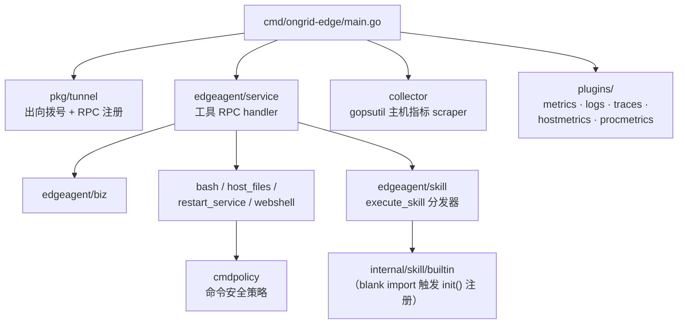

# 04 · 后端详解

> 分层与依赖红线见 [02 总体架构](./02-architecture.md)，此处不重复。
> 本篇回答「这个功能的代码在哪、各子域各管什么」。

## internal/iam — 身份与访问

最小可用的自托管 IAM：无公开注册、无中心化认证，首个 admin 由环境变量
`ONGRID_ADMIN_EMAIL` / `ONGRID_ADMIN_PASSWORD` 在启动时播种（详见
`deploy/README.md` "First login"）。

- 子域只剩 **user**（org / membership 在 ADR-005 私有 MVP 枢轴中删除）；
- 登录 / 刷新 token / RBAC 校验，配套中间件在 `internal/pkg/auth`、`authzmw`；
- data 目录名为 `sqlite/` 是历史命名（由 `mysql/` 重命名而来），实际方言跟随全局 DB 配置。

## internal/manager — 云端业务核心

`manager/biz/` 下每个目录是一个子域。**同 BC 内跨子域 import 是允许的**
（例如 aiops 调 edge），跨 BC 仍然禁止。

| 子域 | 职责 | 关键关联 |
|------|------|----------|
| `aiops` | AI 核心：聊天会话 CRUD、agent loop（tool calling）、工具注册表、scope 校验。子包：`agent`（内核）、`tools`（工具集）、`investigator`（告警自动排查）、`chatruntime`、`graph`、`mentions`、`toolreplay` | 详见 [05 Agent 体系](./05-agent-system.md) |
| `alert` | 告警规则 CRUD、评估器、incident 生命周期 | 触发 `aiops/investigator` 自动 RCA |
| `edge` | edge 注册（AK/SK）、上线 / 心跳 / 版本、升级 bundle（ADR-024） | 经 `pkg/tunnel` 下发 RPC |
| `device` | 设备视图（edge 之上的业务抽象） | Web `/devices` |
| `monitor` / `metric` | 监控面板、指标查询编排 | `pkg/promquery` |
| `promwrite` | 接收 edge 推上来的指标样本，remote_write 进 Prometheus | `pkg/promwrite` |
| `topology` | 拓扑建模与爆炸半径分析 | agent 的 `expand_topology` 等工具 |
| `knowledge` | 知识库 / 代码仓库 RAG：入库、向量化、检索 | `pkg/embedding`、`pkg/qdrantx`、`pkg/docextract` |
| `imbridge` | IM 双向桥：Slack / Telegram / 飞书 / 钉钉 / 企微 / Webhook，按频道 locale | 消息进出都走它，连接 aiops 会话 |
| `webshell` | 浏览器 SSH 会话管理（审计、回放） | edge 侧 `edgeagent/webshell` |
| `skill` / `marketplace` | skill 运行编排 / skill 市场 | `internal/skill` 注册表 |
| `report` | 报表生成与定时调度 | `agents/reporter.md` |
| `audit` | 审计日志（工具调用、shell 会话） | 全局横切 |
| `setting` | 系统设置（模型 key、频道配置等，含脱敏读取） | Web 设置页 |
| `grafana` | Grafana 集成（datasource / dashboard 模板、链接生成） | `pkg/grafana` |

`manager/data/` 与 biz 子域一一对应（GORM repo 实现），`manager/server/` 是 chi
handler 层，`manager/service/` 做用例编排。

## internal/edgeagent — 边端

- **plugins** 管理随包分发的外部采集器进程的生命周期与配置：
  `logs`（promtail → Loki，ADR-012/015）、`traces`（otelcol-contrib → Tempo，ADR-013/015）、
  `hostmetrics`（node_exporter）、`procmetrics`（process-exporter）、`metrics`（开放集 exporter 接入）。
- **cmdpolicy** 是主机侧执行安全的关口：bash 工具是只读沙箱定位，命令受策略约束。
- 注意 `cmd/ongrid-edge/main.go` 里的 blank import
  `_ "github.com/ongridio/ongrid/internal/skill/builtin"`——没有它 skill 注册表为空，
  所有 `execute_skill` 都会报 unknown skill。新增 builtin skill 时别忘了这条链路。
- 本地调试指标端口：边端 `:9101`（与云端 `:9100` 分开，便于同机共存）。

## internal/pkg — 共享库（禁止依赖任何 BC）

| 包 | 用途 |
|----|------|
| `llm` | 多 provider LLM 客户端与路由（`provider/` 子包） |
| `tunnel` | geminio 隧道封装（云端 / 边端共用） |
| `promquery` / `logquery` / `tracequery` | PromQL / LogQL / TraceQL 查询封装 |
| `promwrite` / `prom` / `promauth` | remote_write、指标暴露、Prometheus 鉴权 |
| `embedding` / `qdrantx` / `docextract` | RAG 三件套：向量化、向量库、文档抽取 |
| `auth` / `authzmw` / `passwd` / `tenantctx` | JWT、鉴权中间件、密码哈希、租户上下文（ADR-003） |
| `config` / `logger` / `httpserver` / `dbx` | 配置、slog、HTTP server 骨架（healthz/readyz/metrics）、DB 连接 |
| `notify` | 通知发送（告警通知渠道） |
| `grafana` / `zhipuauth` | Grafana API、智谱鉴权 |
| `errs` | 错误码体系（对应统一响应 `{code, message, data}`） |
| `tracing` | 自身 OTel 接入 |

## API 约定（api/）

完整约定见 [`api/README.md`](../../api/README.md)，核心几条：

- proto 是唯一契约源，**先改 proto 再写代码**，生成代码（`api/gen/`）不提交；
- proto 包名 `ongrid.<bc>[.<subdomain>].v<major>`；每个 RPC 独立 Request/Response 类型；
- `org_id` 永远不是请求字段（来自 JWT claims / URL path，由中间件注入），
  响应里只读回显是允许的；
- REST 路由手写（chi），不用 grpc-gateway；破坏性变更走新版本目录；
- `api/tunnel/v1` 是 geminio 隧道载荷的序列化契约，不是 gRPC service。

## 数据与 schema

- 业务数据在 MySQL（本地可切 SQLite：`ONGRID_DB_DIALECT=sqlite`）。
- Schema 由 GORM `AutoMigrate` 在每次启动时对账——**没有 migration 文件流程**
  （Makefile 里的 `migrate-up/down` target 是预留，仓库内无 `db/migrations` 目录）。
  这意味着模型字段变更要考虑对存量列的兼容性（AutoMigrate 只加不删）。
- 观测数据不进 MySQL：指标在 Prometheus、日志在 Loki、链路在 Tempo、向量在 Qdrant。
