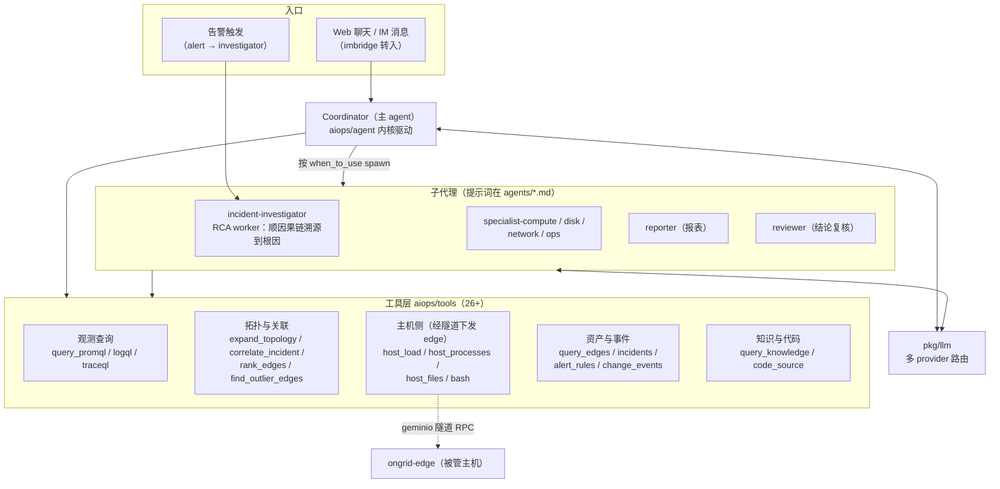
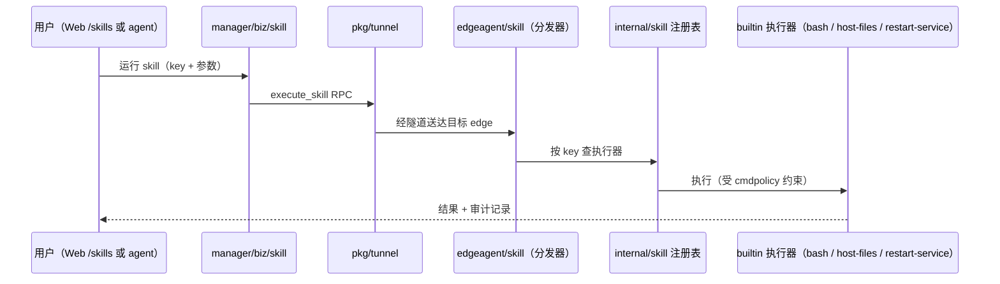
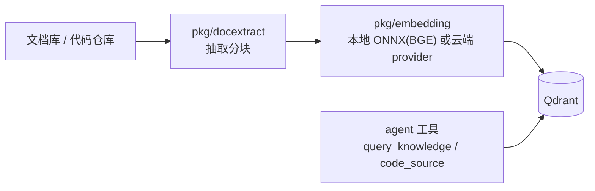

# 05 · AI Agent 体系

Ongrid 的"智能"集中在 `internal/manager/biz/aiops`。这是改动最频繁、
也最需要先理解再动手的区域。

## 总览：coordinator + specialist 双层



- **Coordinator** 接所有用户消息，自己能直接调工具回答简单问题；
  复杂任务按子代理 frontmatter 里的 `when_to_use` 描述 spawn 对应 worker。
- **investigator**（`aiops/investigator`）是告警驱动的自动入口：告警触发 →
  spawn RCA worker → 顺因果链找"0 号病人" → 把根因 / 因果链 / 证据 / 置信度写回聊天频道。

## Agent 内核（aiops/agent）

自研的 tool-calling loop，OpenAI 风格 function calling：

1. 组装 messages（系统提示 + 会话历史 + 工具 schema）；
2. 调 `pkg/llm` 拿补全；模型要么给最终回答，要么发起 tool call；
3. 工具调用经注册表分发执行（带 **scope 校验**——agent 只能碰它被授权的设备 / 数据范围）；
4. 结果回填 messages，循环直到产出最终回答或达到步数上限。

子包分工：

| 子包 | 职责 |
|------|------|
| `agent` | loop 本体、消息组装、子代理（agent-as-tool，见 `agent_tool.go`） |
| `tools` | 全部工具实现 + `registry.go` 注册表 |
| `tools/basetool` | 工具基类 / 公共脚手架（参数 schema、错误处理） |
| `tools/decorators` | 工具装饰器（审计、限流等横切逻辑） |
| `investigator` | 告警自动排查的编排 |
| `chatruntime` | 会话运行时（流式输出、会话状态） |
| `graph` | 因果 / 调查图结构 |
| `mentions` | @设备 / @资源 的解析 |
| `toolreplay` | 工具调用记录与回放（前端展示 agent 都干了什么） |

### 新增一个工具的套路

参照任意一对 `xxx.go` + `xxx_basetool.go`（如 `query_promql.go`）：

1. `xxx.go` 写纯逻辑（依赖经构造函数注入，可单测）；
2. `xxx_basetool.go` 包成 basetool：声明名称、描述（给 LLM 看的，写清楚什么时候用）、
   参数 JSON schema、scope 要求；
3. 在 `registry.go` 注册；带 `_basetool_test.go` 单测；
4. 若工具需要在主机上执行，云端侧只是把 RPC 经 `pkg/tunnel` 推给 edge，
   真正实现在 `internal/edgeagent/`（注意 cmdpolicy 安全策略）。

## 子代理提示词（agents/）

`agents/*.md` 用 frontmatter 描述元信息，正文是系统提示词：

```markdown
---
name: incident-investigator
description: 告警根因诊断 worker，顺因果链溯源到根因（0 号病人）…
when_to_use: |
  coordinator 在用户问以下场景时 spawn 本 worker：…
---
（提示词正文）
```

修改 agent 行为优先改提示词而不是改内核代码；`when_to_use` 写得越具体，
coordinator 的调度越准。

## Skill 体系（internal/skill + skills/）

Skill 是比"工具"更重的、可在主机上执行的能力单元（含参数定义与执行器），
也是 marketplace 的分发单位。



- `skills/` 目录是内置 skill 的**定义**（bash、host-files、restart-service）；
- `internal/skill/builtin` 是**实现**，靠 `init()` 向注册表注册——edge 的 main.go
  必须 blank import 它，否则注册表为空；
- `manager/biz/marketplace` 管 skill 的市场化分发与安装。

## LLM 接入（pkg/llm）

- `provider/` 下每个外部厂商一个适配器：Anthropic / OpenAI / GLM（智谱）/
  DeepSeek / Gemini / Kimi；
- 模型与 key 在 Web 设置页配置（落 `manager/biz/setting`，读取脱敏）；
- 支持热路由：会话可指定模型，未指定走默认 provider（注意 git 历史上修过
  "RCA 自动分析必须回退到默认模型" 的 bug——动模型选择逻辑时跑 `cmd/ongrid` 下的
  `llm_default_test.go`）。

## RAG（knowledge 子域）



本地嵌入是云端镜像带 cgo + ONNX Runtime 的原因；离线包需要先
`make fetch-embedding-model` 预拉 BGE 模型。
