# 06 · 前端详解（web/）

React 18 + TypeScript + Vite 单页应用。UI 红线（配色、克制、组件复用、i18n、
截图验证）在 [`AGENTS.md`](../../AGENTS.md) 的「前端 UI」一节，**动手前必读**；
本篇讲结构。

## 目录结构

```text
web/src/
├── App.tsx          路由表（集中定义，含登录守卫与旧路径重定向）
├── main.tsx         入口
├── pages/           页面级组件（一个路由一个文件；settings/ 子目录是设置页群）
├── components/
│   ├── ui/          基础组件库：Card / Chip / Button / PageHeader / EmptyState …
│   │                ——优先用这些，不要手搓
│   ├── monitor/  topology/  marketplace/  icons/   按领域分组的业务组件
│   └── （顶层）     跨页面复合组件：ChatInput、MessageBubble、Sidebar、
│                    PromQLPanel、XTerminal、CommandPalette、NLQueryHelper …
├── api/             后端 API 客户端（client.ts 是基础 fetch 封装，
│                    其余按子域一个文件：alerts.ts、edges.ts、knowledge.ts …）
├── store/           zustand store：auth / me / chatSessions / mode（light·dark）/
│                    modelSelection / incidentBadge
├── i18n/            双语文案（tr('中文','English') 跟随 locale）
├── styles/index.css Tailwind 入口 + html.light 亮色覆盖
├── lib/             工具函数
└── test/            测试设置（MSW handlers 等）
```

## 路由地图

```mermaid
flowchart LR
    login["/login"]

    subgraph layout["Layout（侧边栏 + 登录态守卫）"]
        home["/ 首页（聊天入口）"]
        chatT["/chat/:sessionId"]
        dash["/dashboard"]
        devices["/devices · /devices/:edgeId<br/>/devices/:deviceId/shell"]
        monitor["/monitor · /logs · /traces"]
        alerts["/alerts · /alerts/rules<br/>/incidents/:id"]
        topo["/topology"]
        knowledge["/knowledge · /knowledge/repos"]
        skills["/skills · /skills/:key"]
        agents["/agents"]
        reports["/reports · /reports/schedules<br/>/reports/:id"]
        shellSess["/edges/shell-sessions（管理）"]
        settings["/settings/*（SettingsLayout）"]
    end

    login --> layout
```



旧路径（`/edges`、`/services`、`/clusters`、`/apps`、`/racks`、`/admin/webshell` 等）
一律 `Navigate replace` 重定向到新路径——改路由时保持这个习惯，别让旧链接 404。

## 关键约定（踩坑高发区）

- **组件复用**：列表页骨架 = `PageHeader` + `Card` + `divide-y` 分行 + `EmptyState`。
  写新页面前先打开 Alerts / Devices / Monitor 三个成熟页对照，跟大多数页面保持一致。
- **配色**：zinc 骨架 + indigo 主操作；语义状态只有 emerald / amber / red / sky，
  走 `Chip` 的 `tone` 属性；状态点用 `-500` 档。满屏正常态用小圆点 + 灰字，
  不给每个 OK 铺彩色底。禁止 `animate-pulse` / 发光阴影 / `hover:scale`。
- **light/dark**：亮色主题靠 `styles/index.css` 里 `html.light` 对 zinc 类的覆盖。
  坑：带透明度的 `bg-zinc-900/20` 不会被 `.bg-zinc-900` 覆盖命中——优先用纯 zinc 类，
  必须用透明度变体时在 `index.css` 补 `html.light .bg-zinc-900\/NN`。
- **i18n**：所有文案 `tr('中文','English')`，禁止中英拼接在同一字符串里。
- **API 层**：新接口先在 `web/src/api/<domain>.ts` 加客户端函数（走 `client.ts`
  统一处理 `{code, message, data}` 与鉴权），页面里不直接 fetch。
- **验证**：视觉改动必须 Chrome headless 截图实看后再提交；涉及主题的 light + dark 各一张。

## 常用命令

```bash
cd web
npm install
npm run dev          # Vite 开发服务器（代理到本地 ongrid API）
npm run build        # tsc -b && vite build（PR 前必跑）
npm run test         # vitest（MSW mock 后端）
npx vitest run src/pages/Alerts.test.tsx   # 单跑一个测试文件
npm run lint         # eslint（warning 上限 50）
npm run typecheck    # tsc -b --noEmit
```

生产形态：`deploy/Dockerfile.web` 在构建阶段自跑 `npm ci && npm run build`，
把 `web/dist/` 烤进 nginx 镜像（ADR-008）；本地 `make build-web` 只是调试用的宿主机构建。
