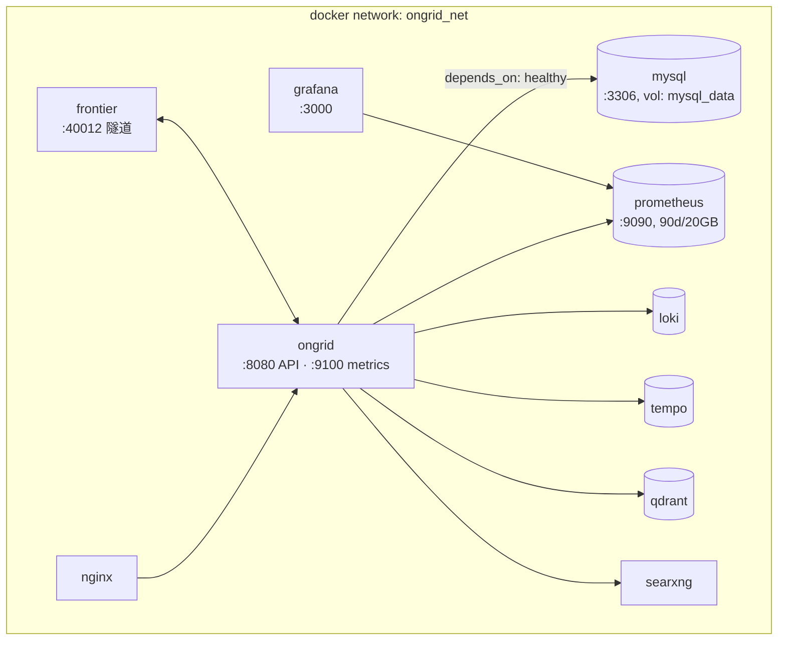
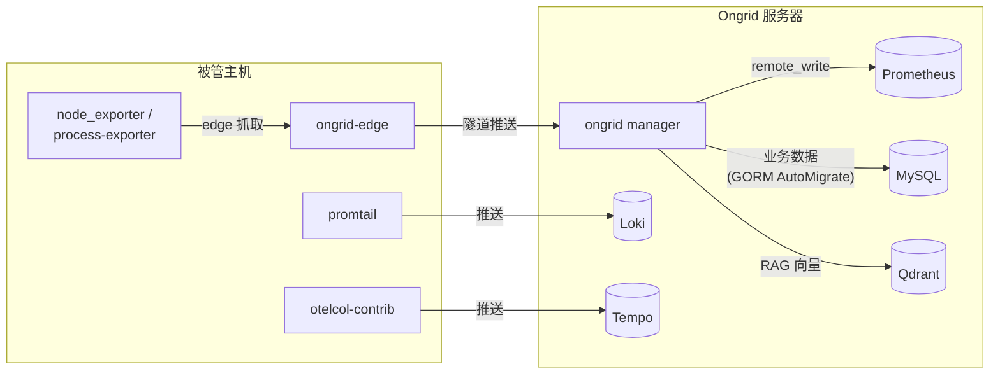
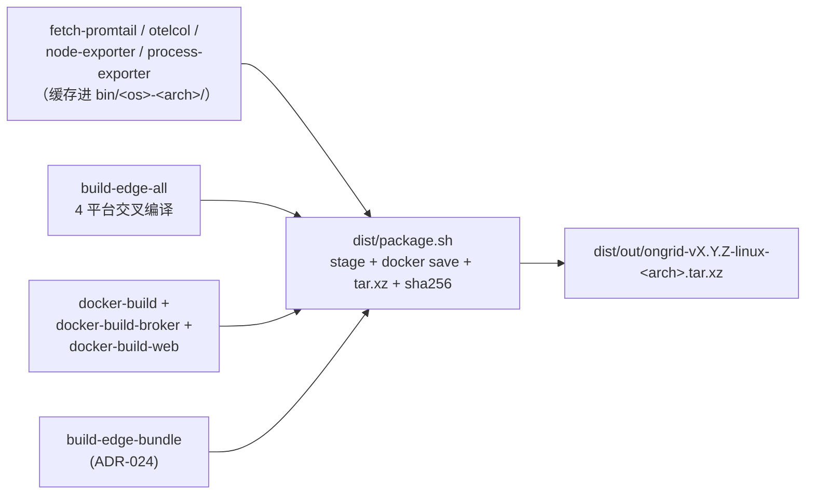

# 07 · 部署与数据

## 两种部署形态

| | 本地开发栈 | 生产安装包 |
|---|-----------|-----------|
| 入口 | `make compose-up`（`deploy/docker-compose.yml`） | `make package` 产出 tarball → 目标机 `sudo ./install.sh` |
| TLS | 无（自签证书仅给隧道占位） | nginx 终结 TLS |
| Prometheus/Grafana | 直接暴露 `:9090` / `:3000` | 不暴露，经 nginx 反代 + ongrid 会话鉴权 |
| 适用 | 日常开发调试 | 用户实际安装（Ubuntu 22.04+ / Debian 12+ / RHEL 9） |

> ⚠️ compose 栈仅限本地：无 TLS、弱密码、无限流。细节见 `deploy/README.md`。

## 本地 compose 栈



```bash
cp deploy/.env.example deploy/.env   # ONGRID_ADMIN_EMAIL/PASSWORD + 模型 key
make compose-up                      # 首次 MySQL 健康检查约 10–20s
make compose-down
```

起来之后：

| 地址 | 服务 |
|------|------|
| `http://localhost:8080` | ongrid HTTP API |
| `http://localhost:9090` | Prometheus UI |
| `http://localhost:3000` | Grafana |
| `localhost:40012` | edge 隧道监听（geminio） |
| `localhost:3306` | MySQL（ongrid/ongrid） |

不想跑 MySQL 容器时可切 SQLite：`ONGRID_DB_DIALECT=sqlite` +
`ONGRID_DB_PATH=/data/ongrid.db`（compose 里有注释标记的 volume 段）。

## Edge 安装

Web 控制台 **Devices** 页生成安装命令，到目标主机执行：

```bash
curl -k -sSL https://<server>/install.sh | bash -s -- \
  --access-key=… --secret-key=… \
  --server-edge-addr=<server>:40012 --server-http-addr=<server>
```

安装脚本布置 systemd 服务 + 采集器（promtail / otelcol-contrib /
node_exporter / process-exporter，linux-only——macOS 主机日志插件会被禁用并告警）。
edge 升级走 ADR-024 的 upgrade bundle（`make build-edge-bundle`）。
完整指南：[`docs/install/edge.md`](../install/edge.md)。

## 数据流与存储分工



| 数据 | 存储 | 备注 |
|------|------|------|
| 用户 / 设备 / 告警 / 会话 / 审计等业务数据 | MySQL（`mysql_data` 卷） | schema 启动时 AutoMigrate；备份 = 备份该卷 |
| 主机与进程指标 | Prometheus | edge → 隧道 → manager remote_write；本地栈保留 90d / 20GB |
| 日志 | Loki | promtail 直推 |
| 链路 | Tempo | otelcol-contrib 直推 |
| 知识库 / 代码向量 | Qdrant（`qdrant_data` 卷） | |

## 发布打包流水线



```bash
make package                    # 当前默认 linux/amd64
make package TARGET_ARCH=arm64  # arm64
make package-all                # 两个架构都打
```

注意事项（都写在 Makefile 注释里，这里提炼）：

- `package` 故意**不**依赖 `build-linux` 和 `build-web`——发布走镜像内构建，
  宿主机产物只用于 `make run-ongrid` 本地调试；
- 离线 RAG 需要先 `make fetch-embedding-model` 预拉 BGE 模型（CN 网络慢且脆，
  所以是手动一次性步骤），否则 tarball 不含模型并给出警告；
- frontier 镜像从上游源码本地构建（`FRONTIER_SRC`，默认 `~/frontier`），
  规避 Docker Hub 拉取不稳。

## 可观测性自身（开发者需要遵守的）

- 云端 `:9100/metrics`、边端 `:9101/metrics`；所有对外服务必须有
  `/healthz` `/readyz` `/metrics`；
- 结构化日志（slog）带 `trace_id`；高基数字段（user_id / email / url）
  禁止做 Prometheus label；敏感字段禁止明文入日志。
