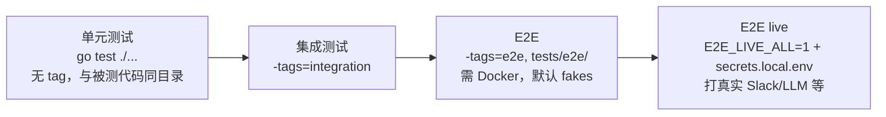

# 08 · 开发工作流

## 原则：Make 是唯一入口

CI、Dockerfile、文档都只调 make target，**禁止裸 `go build` / `docker build`**。
`make help` 列出全部 target。

## 日常命令

```bash
# 构建
make build                # ongrid + ongrid-edge → bin/
make run-ongrid           # go run ./cmd/ongrid（需要本地依赖，通常配合 compose 栈）
make run-ongrid-edge

# 测试（按 build tag 分层）
make test                 # 单元测试（快，无 Docker）
make test-race            # 单元 + -race（CI 强制，提 PR 前至少跑一次）
make test-integration     # build tag: integration
make test-e2e             # build tag: e2e，需 Docker；默认用 fakes，零外部凭证
make test-e2e-live        # 真实外部服务（tests/e2e/secrets.local.env）

# 单跑一个 Go 测试
go test ./internal/manager/biz/alert/... -run TestEvaluator -v

# Lint
make lint                 # golangci-lint
make arch-lint            # go-arch-lint，校验 BC / 分层边界

# API
make proto                # 改了 api/*.proto 之后重新生成（buf，回退 protoc）
```

前端命令见 [06 前端详解](./06-frontend.md#常用命令)。

## 测试分层



- E2E 用 `e2e` build tag 与单元测试隔离，保证 `make test` 始终秒级；
- 每个 e2e 测试对应 [`docs/test/e2e-catalog.md`](../test/e2e-catalog.md) 里的一个
  编号条目，新增时要更新目录的「实现」列；
- E2E 必须清理自己创建的数据；
- 测试约定：共享状态必须加锁并能过 `-race`；新功能必须带单元测试。

## 改不同东西的 checklist

| 改动 | 必做 |
|------|------|
| API 变更 | 先改 `api/*.proto` → `make proto` → 写 handler（带 `@Summary/@Router/@Success`）→ 破坏性变更走新版本 |
| 新子域 / 新依赖 | 在 `cmd/ongrid/main.go` 走构造函数注入装配；跑 `make arch-lint` 确认没越界 |
| Agent 工具 | 参照 `xxx.go + xxx_basetool.go` 双文件套路 + registry 注册 + 单测（见 05） |
| Agent 行为 | 优先改 `agents/*.md` 提示词，而不是内核 |
| 数据模型 | 记住 schema 是 AutoMigrate：只加不删，考虑存量数据兼容 |
| 前端视觉 | Chrome headless 截图实看（主题相关 light + dark 各一张）+ `npm run build` |
| 主机侧执行能力 | 过 `edgeagent/cmdpolicy` 安全策略评审；保持只读定位；接审计 |

## 提交与 PR

- **Conventional Commits**：`feat(scope): …` / `fix(scope): …` / `docs(scope): …` /
  `chore(scope): …`；commit message 默认中文。
- `main` 受保护：一律走 PR，禁止直推与 force push。分支名形如 `fix/tunnel-logs`。
- 一个 PR 只做一件事。
- PR 前自查：`make test-race`（必要时 `make lint` / `make arch-lint`）；
  动了 UI 加 `cd web && npm run build`。
- 文档**不进 README**（README 维护 9 种语言，英文单边改动会漂移）——
  运维 / 部署文档进 `docs/install/`，设计文档进 `docs/design/`。

## 需求载体

不是所有变更都要写 PRD（详见 AGENTS.md）：

| 变更类型 | 载体 |
|---------|------|
| Bug / 小改 / 配置 / 文档修复 | GitHub Issue |
| 重构 / 升级依赖 / 性能优化（用户不感知） | RFC（`docs/rfc/RFC-XXX-*.md`） |
| 用户可感知的功能 | PRD（`docs/requirements/PRD-XXX-*.md`） |
| 跨多个 PRD 的战略 | Epic（`docs/requirements/EPIC-XXX-*.md`） |

## 安全红线（速记版）

完整见 AGENTS.md：密码 bcrypt/argon2id；SQL 全参数化；密钥不进仓库 / 镜像 / 日志；
容器非 root；多租户接口强制 `tenant_id` 过滤；安全漏洞**不开公开 issue**，
走 [SECURITY.md](../../SECURITY.md)。

## 工具链版本

由 asdf 管理（`.tool-versions`）：Go 1.24.0。可选工具：golangci-lint、buf、
migrate（按需安装，Makefile 对缺失的 go-arch-lint / buf 有降级处理）。
