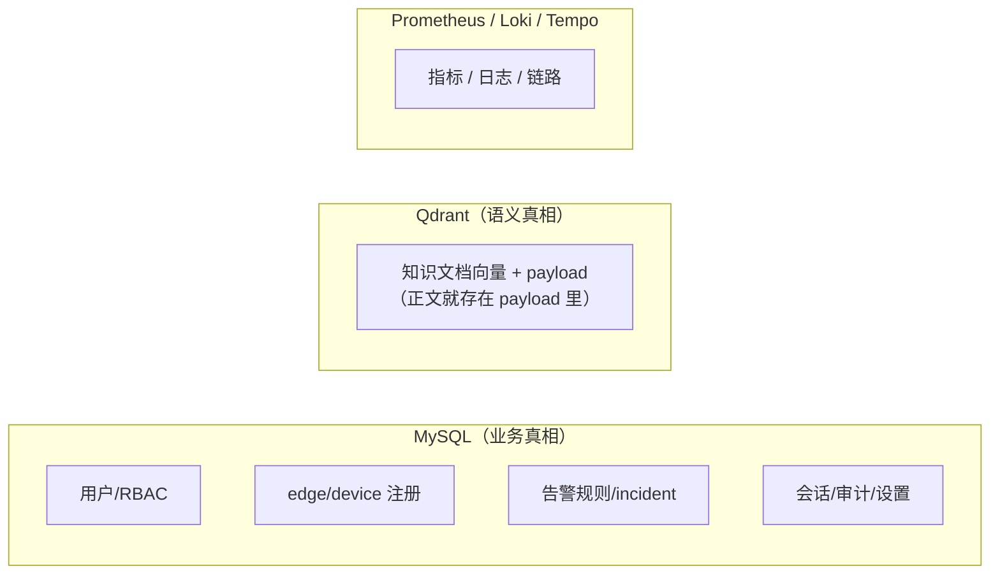

# 09 · 领域概念与术语表

> 代码、PR、ADR 编号里反复出现的词。读代码前先过一遍，
> 避免「device 和 edge 是不是一个东西」这类困惑。

## 核心实体

| 术语 | 含义 | 代码位置 |
|------|------|----------|
| **edge** | 装在被管主机上的 agent 进程（`ongrid-edge`），也指它在云端的注册记录。用 AK/SK 注册，出向拨号到 frontier | `internal/manager/biz/edge`、`internal/edgeagent` |
| **device** | edge 之上的业务抽象（Web 上的「设备」）。一台主机 = 一个 device ≈ 一个 edge，但 device 是面向用户的视图 | `internal/manager/biz/device`，Web `/devices` |
| **manager** | 云端进程（`cmd/ongrid`）的别称，也是 BC 名。文档里说「云端」「manager」「控制面」是一回事 | `internal/manager` |
| **frontier / broker** | 上游开源隧道中继（`singchia/frontier`），edge 与云端之间唯一的通路 | `deploy/Dockerfile.frontier`，ADR-007 |
| **tunnel** | 经 frontier 的 geminio 多路复用连接。云端→edge 的工具 RPC、edge→云端的指标推送、WebShell 流都走它 | `internal/pkg/tunnel`、`api/tunnel/v1` |
| **incident** | 告警触发后聚合出的事件（含调查时间线、RCA 结论）。Web `/incidents/:id` | `internal/manager/biz/alert` |
| **alert rule** | 告警规则。每条规则有 `rule_key`，可关联 runbook_url 深链到内置知识文档锚点 | `internal/manager/biz/alert`，Web `/alerts/rules` |
| **session / chat** | 一次 agent 对话。IM 消息和 Web 聊天都落到 session | `internal/manager/biz/aiops`（chatruntime） |

## Agent 体系词汇

| 术语 | 含义 |
|------|------|
| **coordinator** | 主 agent，接所有用户消息，按需 spawn 子代理 |
| **specialist** | 领域子代理（compute / disk / network / ops），提示词在 `agents/specialist-*.md` |
| **investigator** | 告警自动排查入口：告警触发 → spawn RCA worker（`agents/incident-investigator.md`） |
| **RCA / 根因 / 0 号病人** | Root Cause Analysis。项目黑话「0 号病人」= 因果链最上游的源头，区别于症状 |
| **blast radius / 爆炸半径** | 沿拓扑图评估一个故障影响到哪些服务/主机（`biz/topology`） |
| **tool / basetool** | agent 可调用的函数。`basetool` 是工具脚手架基类，每个工具 = `xxx.go`（逻辑）+ `xxx_basetool.go`（schema/注册） |
| **scope** | 工具调用的授权范围（agent 只能碰被授权的设备/数据），由工具注册表强制 |
| **skill** | 比 tool 更重的主机侧能力单元（带参数定义 + 执行器），经 `execute_skill` RPC 在 edge 上跑；marketplace 的分发单位 |
| **toolreplay** | 工具调用的记录与回放，前端用它展示「agent 都干了什么」 |
| **mentions** | 聊天里 @设备 / @资源 的解析 |

## 知识库词汇

| 术语 | 含义 |
|------|------|
| **vault / 内置知识库** | 平台自带的知识内容。来源 `github.com/ongridio/vault`，离线兜底用内嵌快照（`biz/knowledge/builtin_vault/`）。**只读**，同步会重新生成 |
| **org 知识库 / 组织知识库** | 用户自己的内容：`manual`（手写）+ `upload`（上传文件），可 CRUD |
| **source_type** | 文档来源：`vault` / `repo`（git 仓库爬取，只读）/ `manual` / `upload` / `url` |
| **repo（knowledge）** | 接入的 git 文档/代码仓库，定时 sync 进向量库；与「代码仓库」页对应 |
| **chunk** | 长文档切块后逐块嵌入；上传文件的多个 chunk 共享同一 url 身份 |
| **point** | qdrant 中的一条向量记录。doc id = md5 派生的 uint64（JS 端按 string 处理，防 2^53 溢出） |

## 工程黑话

| 术语 | 含义 |
|------|------|
| **BC** | Bounded Context（iam / manager / edgeagent），见 02 |
| **DI root** | `cmd/ongrid/main.go`——所有构造函数注入的装配点 |
| **ADR-xxx** | 设计决策编号，散见代码注释。常引用的见下表 |
| **gospec** | 项目遵循的 Go SDLC 规范（AGENTS.md 是其摘要） |
| **m/l/t** | metrics / logs / traces 三件套 |
| **开放集 exporter** | 用户主机上任意 Prometheus exporter，edge 抓取后经隧道推到云端 remote_write 入库 |

## 常被引用的 ADR（编号 → 主题）

> ADR 全文未入库，编号语义靠代码注释传承；改相关代码时保持引用习惯。

| 编号 | 主题 |
|------|------|
| ADR-003 | 租户上下文：`org_id` 只来自 JWT claims，绝不是请求字段 |
| ADR-005 | 私有 MVP 枢轴：iam 砍掉 org/membership，只剩 user |
| ADR-007 | 采用 frontier 作为隧道 broker |
| ADR-008 | 前端 SPA 烤进 nginx 镜像；API 不再直接对外发布端口 |
| ADR-012 / 013 / 015 | edge 的 logs（promtail）/ traces（otelcol）插件体系 |
| ADR-024 | edge 升级 bundle（云端分发、edge 自升级） |
| ADR-026 | 自观测 |
| ADR-028 | 组织知识库（upload 来源 + 组织 CRUD） |
| ADR-029 | 知识库目录树 + 文档移动（拖拽）+ vault 云同步 |

## 一图记住数据归属

注意：**知识文档的正文不在 MySQL**——标题、路径、正文全部存在 qdrant point 的
payload 里，这就是为什么知识库 CRUD 全在 `biz/knowledge` 直接打 qdrant。
