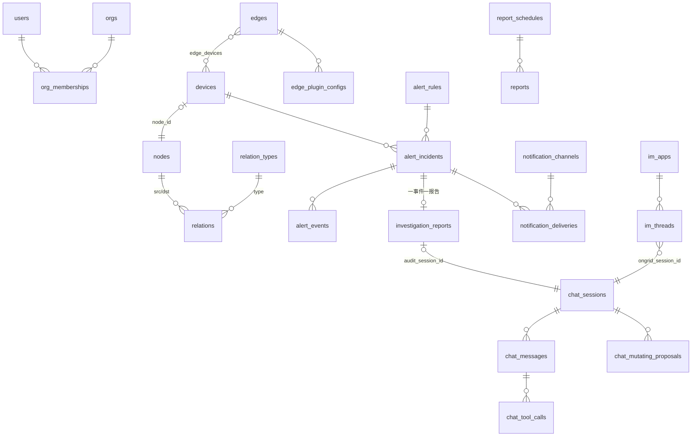

# 11 · 数据库表结构设计

> 关系库（MySQL / SQLite）里每张表是什么、归哪个子域管、关键字段与索引怎么设计的。
> 改 schema 前先读本文 + `AGENTS.md` 的数据红线；模型定义的源头是
> `internal/*/model/`（Go struct + gorm tag），本文是导览不是替代——以代码为准。

## 存储选型与总览

| 存储 | 用途 | 说明 |
|------|------|------|
| MySQL（默认）/ SQLite（可选） | 全部业务关系数据 | `dbx.Open` 按 `ONGRID_DB_DIALECT` 选方言；模型 dialect-agnostic，禁止方言特定 SQL |
| Qdrant | 知识库文档 + 向量 | `knowledge_docs` **不是** SQL 表——doc 正文/标题/tags 全部作为 qdrant point payload 存储，SQL 只存 `knowledge_repos` 注册表 |
| Prometheus / Loki / Tempo | 指标 / 日志 / 链路 | 可观测性信号不入关系库（`host_metrics_*` 是早期内置指标通道，见下） |

Schema 管理使用 **GORM AutoMigrate**（`cmd/ongrid/main.go` 启动时按依赖顺序跑各
data 包的 `Migrate(db)`），适用当前单机自部署形态；生产化后的版本化 migration
约束见 gospec `13-database-migration/`。

约定（继承自 gospec `04-data-model/mysql.md`，再加本项目特例）：

- 主键：配置类行用 `id BIGINT autoIncrement`；**产物类行用 `char(36)` UUID**
  （chat_sessions / reports / investigation_reports / chat_mutating_proposals），
  避免路由可枚举、客户端可先行生成 id。
- 通用列：`created_at` / `updated_at`；需要可恢复删除的表带 `deleted_at`
  （gorm 软删除，必有索引）。审计类表（audit_logs / alert_events /
  skill_executions / webshell_sessions）**不做软删除**——审计行只增不改。
- **MySQL 禁止 TEXT 列带 DEFAULT（Error 1101）**：所有 `text` / `longtext`
  列声明 `not null` 但不写 `default:''`，由 biz 层保证插入时总是给值
  （空串 = "尚无"）。这是本仓库被生产事故验证过的硬约定。
- 半结构化数据一律 `*_json` TEXT 列（labels / conditions / scope / config…），
  schema 演进零成本；需要查询的字段才提升为真列。
- 无 `org_id`：私有化单租户 MVP，归属用 `created_by` / `user_id` 表达；
  `installed_skills.tenant_id`、`system_settings.category` 等列为未来多租户预留。
- 中文注释、密钥红线：`pass_hash` / `secret_key_hash` 为 argon2id；
  `ssh_identities.private_key`、`system_settings` 敏感 value 落库前 AES 加密，
  永不入日志。

## 表清单（按子域）

### iam — 用户与组织（`internal/iam/model`）

| 表 | 实体 | 要点 |
|----|------|------|
| `users` | User | `email` 唯一；`pass_hash` argon2id；`role`(admin/user/viewer) 为旧列，新权限走 memberships + casbin；`is_superuser` 绕过 casbin（防策略表损坏锁死运维） |
| `orgs` | Org | `name` 全局唯一；`parent_id` 自引用可嵌套，**不做 FK 约束**（gorm + sqlite 方言漂移使 FK 不可靠，完整性由 biz 层守），权限不沿层级继承 |
| `org_memberships` | OrgMembership | users↔orgs N:M，`(user_id, org_id)` 唯一；`role`(`org_admin/member/viewer`) 即 casbin subject，每次变更由 biz 层镜像进 casbin |
| `casbin_rule` | — | gorm-adapter 自动建表，归 iam biz 层所有，不在 model 包出现 |

### manager/alert — 告警（`internal/manager/model/alert`）

| 表 | 实体 | 要点 |
|----|------|------|
| `alert_rules` | Rule | `rule_key` 唯一（dedupe 用的稳定标识）；`kind` 决定 `conditions_json` 怎么解释（metric_raw / anomaly / forecast / burn_rate…，legacy kind 启动时归一化）；`notify_window_seconds`+`notify_min_fires` 是发送策略阻尼门 |
| `alert_incidents` | Incident | `dedupe_key` 唯一是去重核心；`device_id` 可空（global 范围告警）；状态机 open→acknowledged/silenced→resolved；first/last_fired_at 各有索引支撑列表排序 |
| `alert_events` | Event | incident 的只增时间线（firing / ack / resolve / 通知结果 / AI 初诊…），联合索引 `(incident_id, created_at)` 服务 detail 页 |
| `alert_silences` | Silence | 静默窗口，`matchers_json` 存匹配器；`(status, ends_at)` 联合索引供过期扫描 |
| `notification_channels` | Channel | webhook/slack/feishu/dingtalk/wecom/telegram；`config_json` 存凭据；`match_severity_min` + `match_scope_types` 是路由过滤器 |
| `notification_deliveries` | Delivery | 每次通知投递一行（请求/响应/错误全留底），`(incident_id, channel_id)` 联合索引 |
| `investigation_reports` | InvestigationReport | AI 根因分析产物，UUID 主键；`incident_id` 唯一（一事件一报告）；状态机 pending→running→ready/failed/skipped；`audit_session_id` 指向 kind='investigation' 的 chat_sessions 行 |

### manager/device + edge — 设备与边端（`model/device`、`model/edge`）

2026-05 实体拆分：**Device 是被监控的主机**（hostname/OS/容量/角色），
**Edge 是注册的 agent 身份**（access key、在线状态），经 `edge_devices` N:M 关联。

| 表 | 实体 | 要点 |
|----|------|------|
| `devices` | Device | `fingerprint` 唯一（主机身份）；`roles` 是 4-bit 位域（`server/storage/network/database`，查询时展开成 `IN (...)` 走索引）；CPU/Mem/Disk 用量百分比为反规范化列（避免列表页 JOIN 指标表）；`node_id` 唯一、链到拓扑 `nodes` |
| `edges` | Edge | `access_key_id` 唯一 + `secret_key_hash`(argon2id)；`device_id` 是宿主设备便捷指针，真相在 junction |
| `edge_devices` | EdgeDevice | `(edge_id, device_id, type)` 唯一；type=host/discovered |
| `edge_plugin_configs` | PluginConfig | `(edge_id, plugin_name)` 唯一；`enabled` + 自由形态 `spec_json`（端点/凭据刻意不入库，下发时派生） |

### manager/topology — 业务拓扑（`model/topology`）

类型化属性图：实体表通过自己的 `node_id` 链到 `nodes`，关系只引用 `node`，
故 `device↔service↔cluster` 的边在图层同构。

| 表 | 实体 | 要点 |
|----|------|------|
| `nodes` | Node | `(type, name)` 联合索引；`props_jsonb` 自由属性袋 |
| `relations` | Relation | 有向边，`(src_id, dst_id, type)` 唯一；语义在 relation_types |
| `node_types` | NodeType | `name` 为主键（字符串）；5 个内置行每次启动 upsert 种子；`tier` 决定分层图位置 |
| `relation_types` | RelationType | 6 个内置行（member_of/depends_on/…）；`propagates_failure` + `direction` + `semantics_tag` 三个语义字段驱动 AIOps 推理，自定义类型必须声明 |

### manager/aiops — 对话与 Agent（`model/aiops`）

| 表 | 实体 | 要点 |
|----|------|------|
| `chat_sessions` | Session | UUID 主键；`kind`(user/investigation) 区分人发起与告警自动调查；`parent_session_id` + `agent_id` 支撑 coordinator/worker 子代理树 |
| `chat_messages` | Message | UUID；`content` 可空（assistant 只发 tool_calls 的轮次）；`model` + token 列做逐条溯源 |
| `chat_tool_calls` | ToolCall | 每次工具调用一行（参数/结果/状态/耗时）；`llm_call_id` 保证历史回放时 tool 消息配对（严格 provider 要求） |
| `chat_mutating_proposals` | MutatingProposal | 写操作审批的审计真相源：ReviewGate 拦截每个 mutating tool_call 落一行，approve/reject 都留底。独立成表（而非塞 chat_tool_calls）因为 reject 时没有执行行 |
| `user_agents` | UserAgent | UI 创建的自定义 persona；`name` 唯一；工具白/黑名单 JSON |

### manager/metric — 内置主机指标（`model/metric`）

三层时序降采样，行键 `(edge_id, ts)`：

| 表 | 要点 |
|----|------|
| `host_metrics_raw` | 10s 原始样本，自增 id + `(edge_id, ts)` 联合索引 |
| `host_metrics_5m` / `host_metrics_1h` | 聚合桶，**复合主键 `(edge_id, ts)`**（无自增列）；gauge 存 avg+max、counter 存 sum |
| `host_metrics_dead_letter` | 写入重试耗尽的样本 + `error_reason`，保留 7 天 |

### manager 其余子域

| 表 | 子域 | 要点 |
|----|------|------|
| `system_settings` | setting | `(category, key)` 唯一的 KV 配置（llm/prom/grafana/loki/tempo/websearch…）；`sensitive=true` 的 value 列表接口必须掩码 |
| `knowledge_repos` | knowledge | git 仓库注册（url 唯一、branch、last_synced_at）；文档本体在 Qdrant |
| `ssh_identities` | knowledge | git clone 用 SSH 私钥，`name` 唯一；private_key/passphrase 落库前 AES 加密；`hosts` 为 glob 数组 JSON |
| `im_threads` / `im_apps` | imbridge | app=(provider, app_id) 唯一的 bot 注册（secret 加密）；thread=`(im_app_id, im_chat_id, im_thread_id)` 唯一 → 映射到一个 chat_session（一群一会话，O(活跃群) 增长） |
| `report_schedules` / `reports` | report | schedule 自增 id + `(enabled, next_fire_at)` 索引供 cron 扫描；report 为 UUID 产物行，`(schedule_id, period_start)` 唯一防重复生成，`share_token` 唯一支撑外部只读分享 |
| `monitor_panels` | monitor | 用户自建 PromQL 面板，`ordinal` 排序；单向镜像到 Grafana |
| `webshell_sessions` | webshell | WebSSH 审计：开会话 INSERT、关会话 UPDATE（字节数/退出码/终止原因）；**绝不存密码** |
| `audit_logs` | audit | HLD-010 审计流水：actor/action/resource/outcome，`payload_json` 必须先脱敏（只存变更形状不存值）；occurred_at/user/action/resource/status 各有查询索引 |
| `skill_executions` | skill（biz 层） | 每次 skill 派发一行（参数/结果/错误/起止时间） |
| `installed_skills` | marketplace | `(tenant_id, pack_id)` 唯一；`manifest_sha256` 内容锁供启动校验 |

### edgeagent

边端**无关系库**——`internal/edgeagent/model` 只有内存值类型（HostMetric /
ProcessInfo），数据经隧道推到云端。

## ER 关系（核心链路）

注意：以上"外键"几乎都是**逻辑外键**（列 + 索引，不建 DB 级 FK 约束），
完整性由 biz 层保证——与 `orgs.parent_id` 的注释同因：跨方言 FK 行为漂移。

## 改表怎么做

1. 改 `internal/<bc>/model/<域>/` 的 struct + gorm tag（**所有字段显式
   `column:`**，新表必须 `TableName()` 钉死表名）。
2. 该域 data 包的 `Migrate(db)` 已含此模型则无需动；新表要加进
   `db.AutoMigrate(...)`，新 data 包要在 `cmd/ongrid/main.go` 的
   `dbx.RunMigrations` 列表注册。
3. 列改名/类型变更 AutoMigrate 不会替你做——参考
   `internal/manager/data/alert/store/migrate.go` 的一次性数据迁移写法
   （可重入：缺列检测 + 幂等 UPDATE）。
4. 跑 `make test`（数据层测试用 SQLite 内存库）+ `make test-e2e`（MySQL 路径）。
5. 自查：TEXT 列没写 DEFAULT？查询条件列有索引？审计表没加软删除？
   敏感字段加密/掩码了？

## 相关文档

- [07 部署与数据](./07-deploy-and-data.md) — 存储分工、备份边界、compose 栈
- gospec `04-data-model/mysql.md` — 通用表设计规范（字段命名/类型/索引红线）
- `AGENTS.md` — 数据与安全红线
