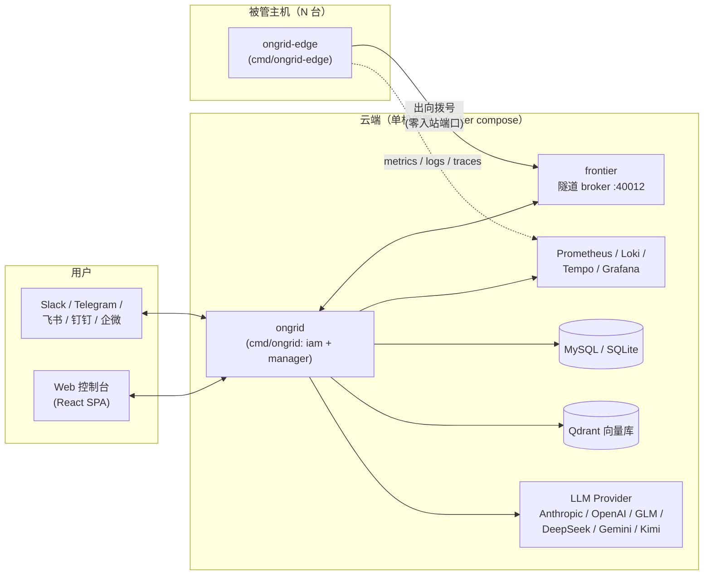

# Ongrid 开发者文档

> 面向新加入的开发者：帮助你在最短时间内理解 Ongrid 的架构、技术栈与代码组织，
> 知道「改一个功能该去哪个目录、遵守哪些规则、怎么验证」。
>
> 硬性规范（红线）见仓库根目录 [`AGENTS.md`](../../AGENTS.md)，本文档不重复，只做解释与导览。

## 文档目录

| 文档 | 内容 | 适合什么时候读 |
|------|------|----------------|
| [01 项目概览](./01-overview.md) | Ongrid 是什么、核心功能、双进程模型 | 第一天 |
| [02 总体架构](./02-architecture.md) | 系统拓扑、Bounded Context 划分、分层规则、代码地图 | 写第一行代码前 |
| [03 技术栈](./03-tech-stack.md) | 后端 / 前端 / 存储 / 可观测性 / AI 全栈清单 | 随时查阅 |
| [04 后端详解](./04-backend.md) | 三大 BC 各子域职责、API 约定、请求生命周期 | 改后端代码前 |
| [05 AI Agent 体系](./05-agent-system.md) | coordinator / specialist / investigator、工具注册、Skill、LLM 接入 | 改 agent / 工具前 |
| [06 前端详解](./06-frontend.md) | 路由、目录结构、状态管理、UI 与 i18n 约定 | 改前端代码前 |
| [07 部署与数据](./07-deploy-and-data.md) | 本地 compose 栈、生产安装包、数据存储、可观测性管道 | 调试环境 / 发版前 |
| [08 开发工作流](./08-dev-workflow.md) | 构建、测试、lint、proto、提交与 PR 规范 | 提交代码前 |
| [09 领域概念与术语表](./09-domain-glossary.md) | 代码 / PR / ADR 里反复出现的词 | 读代码前 |
| [10 常见开发任务 Cookbook](./10-cookbook.md) | 「做 X 该碰哪些文件、按什么顺序」 | 接到具体任务时 |
| [11 数据库表结构设计](./11-database-schema.md) | 全部表清单、字段与索引约定、ER 关系、改表流程 | 改 schema 前 |

## 5 分钟速览

Ongrid 是一个**运维 AI Agent**：接入你的基础设施（指标 / 日志 / 链路 / 拓扑），
在 Slack / Telegram / Web 里回答「这台机器为什么挂了」，自动做根因分析（RCA），
并能在审计下远程执行只读诊断命令。



三个最重要的事实：

1. **两个二进制**：`ongrid`（云端大脑）和 `ongrid-edge`（主机上的探针 + 执行器）。
   Edge **只出不进**——主机不需要开放 22 / 80 / 443，agent 主动拨号到云端的 frontier broker。
2. **三个 Bounded Context**：`internal/iam`（用户认证）、`internal/manager`（云端业务）、
   `internal/edgeagent`（边端），两两**禁止互相 import**，由 `make arch-lint` 强制。
3. **Make 是唯一入口**：构建 / 测试 / 打包全部走 `make <target>`，禁止裸 `go build` / `docker build`。

## 上手路径建议

```bash
# 1. 起本地全栈（manager + MySQL + Prometheus/Loki/Tempo/Grafana + frontier）
cp deploy/.env.example deploy/.env   # 填 admin 账号 + 至少一个模型 API key
make compose-up

# 2. 浏览器打开 http://localhost:8080 登录，逛一遍 Web 控制台

# 3. 跑通测试，确认环境 OK
make test
cd web && npm install && npm run test

# 4. 读 02-architecture.md，对照 internal/ 目录走一遍代码
```
