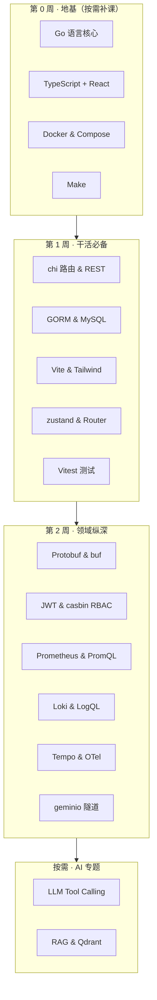

# 技术栈入门系列

> 掌握 Ongrid 全栈所需的每个细分技术，一栈一篇：基础概念 + 在本仓库的实用指引。
> 每篇都很短（10 分钟内读完），目标不是替代官方文档，而是给你「够用的心智模型 +
> 本仓库的惯用法 + 坑」，需要深入时再去文末的资料。

## 学习路线图

## 目录

### 地基

| 文档 | 你将学会 |
|------|----------|
| [Go 语言核心](./go.md) | goroutine / channel / context / errgroup / 错误包装 / slog / 表驱动测试 |
| [TypeScript + React](./typescript-react.md) | 类型系统要点、hooks 心智模型、本仓库组件惯用法 |
| [Docker & Compose](./docker-compose.md) | 镜像 / 容器 / 多阶段构建 / compose 服务编排 |
| [Make](./make.md) | target / 依赖 / 变量，读懂本仓库 Makefile |

### 后端干活

| 文档 | 你将学会 |
|------|----------|
| [chi 路由 & REST](./chi.md) | 路由树、中间件、handler 模式、Swagger 注释约定 |
| [GORM & MySQL](./gorm.md) | 模型映射、AutoMigrate、查询/事务、SQLite 切换 |
| [Protobuf & buf](./protobuf-buf.md) | message/service 语法、buf generate / breaking |
| [JWT & casbin RBAC](./auth-casbin-jwt.md) | token 结构、刷新链路、casbin 模型、租户上下文 |
| [geminio 隧道](./tunnel-geminio.md) | 出向拨号模型、frontier broker、RPC over 隧道 |

### 前端干活

| 文档 | 你将学会 |
|------|----------|
| [Vite & Tailwind](./vite-tailwind.md) | dev/build 管线、chunk 切分、原子类、本仓库配色体系 |
| [zustand & React Router](./zustand-react-router.md) | 全局状态、persist、路由表与懒加载 |
| [Vitest & Testing Library](./vitest-testing.md) | 组件测试、MSW mock、user-event |

### 可观测性

| 文档 | 你将学会 |
|------|----------|
| [Prometheus & PromQL](./prometheus-promql.md) | 数据模型、四类指标、PromQL 常用式、remote_write、Grafana |
| [Loki & LogQL](./loki-logql.md) | label 流模型、LogQL 查询、promtail 采集 |
| [Tempo & OpenTelemetry](./tempo-otel.md) | trace/span 模型、TraceQL、otelcol 管道 |

### AI 专题

| 文档 | 你将学会 |
|------|----------|
| [LLM Tool Calling](./llm-tool-calling.md) | chat completions、function calling 循环、agent loop、eino |
| [RAG & Qdrant](./rag-qdrant.md) | 嵌入向量、相似度检索、chunk 策略、qdrant API |

## 怎么用这套文档

- **别从头读到尾**。先做 [docs/dev](../README.md) 的上手路径，遇到看不懂的栈再来补对应篇；
- 每篇的「在本仓库」一节给了可以直接打开对照的文件，**边读边开代码**效果最好；
- 官方文档链接放在每篇末尾，本系列讲不清的细节以官方为准。
