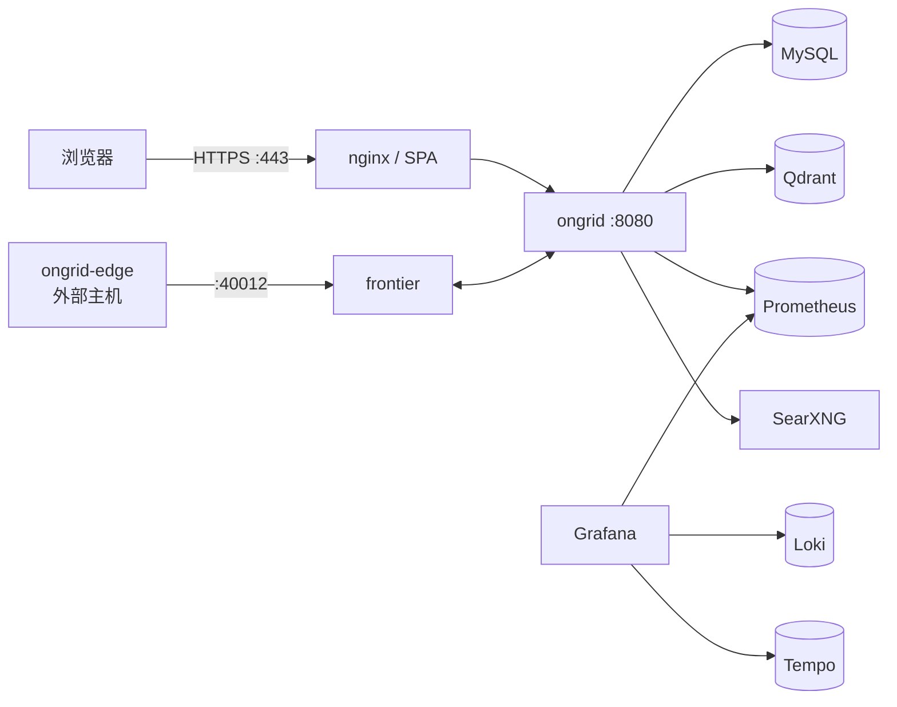

# Docker & Docker Compose

> Ongrid 用 Docker 固化构建和运行环境，用 Compose 编排本地完整云端栈。
> 日常启动入口是根目录的 `make compose-up`；`deploy/docker-compose.yml`
> 只用于本地开发，不等同于生产安装配置。

## 核心概念

### 1. 镜像、容器与 layer

- **镜像（image）**是只读模板，包含文件系统、运行时和启动命令；
- **容器（container）**是镜像的一次运行实例，删除容器不等于删除镜像；
- Dockerfile 每条 `RUN` / `COPY` 通常形成一层。前面的层没变就能复用缓存。

因此 Dockerfile 会先复制依赖清单，再复制源码：

```dockerfile
COPY go.mod go.sum ./
RUN --mount=type=cache,target=/go/pkg/mod go mod download
COPY . .
RUN --mount=type=cache,target=/root/.cache/go-build go build ...
```

只改业务代码时，模块下载层仍命中缓存；改 `go.mod` 才会重新下载依赖。
前端镜像同理：先 `COPY package*.json` + `npm ci`，再复制 `web/`。

### 2. 多阶段构建

构建工具不应全部留在运行镜像里。多阶段构建先用完整工具链产出二进制或静态文件，
再只复制运行所需内容：

```dockerfile
FROM golang:1.25-bookworm AS builder
RUN go build -o /out/ongrid ./cmd/ongrid

FROM debian:bookworm-slim
COPY --from=builder /out/ongrid /ongrid
ENTRYPOINT ["/ongrid"]
```

本仓库三类镜像的取舍不同：

| 镜像 | 构建阶段 | 运行阶段 | 原因 |
|------|----------|----------|------|
| `ongrid` | Go + gcc/glibc | Debian slim、非 root | 本地嵌入依赖 ONNX Runtime 和 CGO |
| `ongrid-edge` | Go Alpine，`CGO_ENABLED=0` | distroless、非 root | 边端是纯 Go 静态二进制，运行面尽量小 |
| `ongrid-web` | Node 构建 SPA | nginx Alpine | nginx 同时提供静态页面、TLS 和 API 反代 |

### 3. Compose 是什么

Compose 用一份 YAML 描述多个容器及其关系：

```yaml
services:
  ongrid:
    depends_on:
      mysql:
        condition: service_healthy
    networks: [ongrid_net]

  mysql:
    healthcheck:
      test: ["CMD-SHELL", "mysqladmin ping -h localhost -u root -prootpw"]
    volumes:
      - mysql_data:/var/lib/mysql
```

关键字段：

- `services`：容器角色；服务名同时是 Compose 网络内 DNS 名；
- `build` / `image`：本地构建方式与最终镜像名；
- `environment`：传给进程的配置；
- `ports`：`宿主机端口:容器端口`；
- `volumes`：持久化数据或挂载配置；
- `depends_on`：启动依赖；配合 healthcheck 才能表达“依赖已可用”；
- `networks`：容器间的隔离网络。

### 4. 容器网络

全部云端组件都加入 `ongrid_net`。容器之间用**服务名 + 容器端口**访问，
不要写 `localhost`：

```text
ongrid -> mysql:3306
ongrid -> qdrant:6333
ongrid -> prometheus:9090
nginx  -> ongrid:8080
grafana -> loki:3100 / tempo:3200
```

容器里的 `localhost` 只指当前容器。宿主机访问则看 `ports`：

| 宿主机地址 | 用途 |
|------------|------|
| `https://localhost` | nginx 入口：SPA + `/api` + 观测组件反代 |
| `http://localhost:9100/metrics` | manager 指标 |
| `http://localhost:9090` | Prometheus 开发 UI |
| `http://localhost:3000` | Grafana 开发 UI |
| `localhost:3306` | MySQL 开发连接 |
| `localhost:40012` | edge 拨入的 frontier 端口 |

manager 的 `8080` 没有发布到宿主机，正常应经 nginx 访问。

### 5. 数据卷与 bind mount

两种挂载用途不同：

```yaml
volumes:
  - mysql_data:/var/lib/mysql                   # named volume：持久数据
  - ./nginx/nginx.conf:/etc/nginx/nginx.conf:ro # bind mount：仓库配置
```

本地持久卷包括 MySQL、Prometheus、Grafana、Qdrant、Loki、Tempo。
`make compose-down` 只停容器，卷会保留；`docker compose down -v`
会删除卷和其中数据，执行前必须确认。

## 在本仓库

### 本地栈拓扑



`ongrid-edge` 故意不在默认 compose 服务里：真实部署中它运行在被管主机，
主动拨号到 frontier。文件末尾保留了本地 demo stanza。

| 想看什么 | 打开 |
|----------|------|
| 本地服务编排 | `deploy/docker-compose.yml` |
| 云端镜像 | `deploy/Dockerfile.ongrid` |
| 边端镜像 | `deploy/Dockerfile.ongrid-edge` |
| SPA + nginx 镜像 | `deploy/Dockerfile.web` |
| nginx TLS / 反代 | `deploy/nginx/nginx.conf` |
| 生产安装编排 | `deploy/install/docker-compose.yml`、`deploy/install/README.md` |

## 实用指引

```bash
# 首次准备：按需填写管理员和模型配置，不提交该文件
cp deploy/.env.example deploy/.env

# 启停统一走根 Makefile
make compose-up
make compose-down

# 查看状态和日志（诊断命令可以直接使用 docker compose）
docker compose -f deploy/docker-compose.yml ps
docker compose -f deploy/docker-compose.yml logs -f ongrid
docker compose -f deploy/docker-compose.yml logs --tail=100 nginx
```

`make compose-up` 会在缺少时生成 `deploy/certs/tls.crt` 和 `tls.key`。
它们是本地自签证书，浏览器首次访问会警告；已有证书不会被覆盖。

修改源码后的常见动作：

```bash
make docker-ongrid VERSION=dev
make docker-build-web VERSION=dev
make compose-up
```

本地 compose 默认使用 `ongrid:dev` / `ongrid-web:dev`，所以显式重建时要把
`VERSION=dev` 作为 Make 命令行变量传入。Compose 不保证在已有镜像时自动重建源码。
怀疑跑的不是最新代码时，先确认镜像构建时间：

```bash
docker image inspect ongrid:dev --format '{{.Created}}'
docker inspect ongrid --format '{{.Image}}'
```

常见排障顺序：

1. `docker compose ... ps`：容器是 `Up`、`unhealthy` 还是反复 `Restarting`；
2. `docker compose ... logs <service>`：先看第一个错误，不要只看最后一行；
3. `docker inspect <container>`：核对环境变量、挂载和健康检查；
4. 在容器网络内验证依赖地址，记住不能把容器里的 `localhost` 当宿主机；
5. 确认磁盘空间和 named volume 状态，再考虑重建容器。

## 坑位提醒

- `depends_on: service_started` 只代表进程启动，不代表服务已就绪；MySQL 使用
  `service_healthy` 是为了避免 manager 抢跑；
- `.env` 只用于 Compose 变量替换，不会自动成为容器环境，仍需在
  `environment` / `env_file` 中声明；
- bootstrap admin 只在用户表为空时创建，改 `.env` 不会覆盖已有用户密码；
- `latest` 可能随时间漂移。本仓库只有 SearXNG 本地开发镜像使用它，
  核心数据组件都固定版本；
- `deploy/docker-compose.yml` 含开发弱密码和直接暴露端口，禁止当生产配置使用；
- 不要用 `docker compose down -v` 作为普通“重启”手段，它会清空本地持久数据。

## 学习资料

- [Docker Get Started](https://docs.docker.com/get-started/)
- [Dockerfile reference](https://docs.docker.com/reference/dockerfile/)
- [Compose file reference](https://docs.docker.com/reference/compose-file/)
- [Build cache optimization](https://docs.docker.com/build/cache/optimize/)
