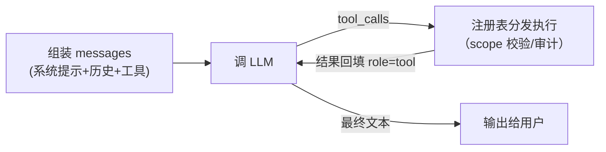

# LLM Tool Calling & Agent Loop

> Ongrid 的「智能」= LLM + 工具调用循环。改 aiops 子域前必须理解这套机制，
> 否则连日志都看不懂。

## 核心概念

### 1. Chat Completions：无状态的消息数组

LLM API 本身没有记忆。每次调用都把**完整对话**作为 `messages` 数组发过去：

```json
[
  {"role": "system",    "content": "你是 SRE 助手……（人设/规则）"},
  {"role": "user",      "content": "db-3 内存为什么飙了"},
  {"role": "assistant", "content": "...上一轮的回答..."},
  {"role": "user",      "content": "继续查"}
]
```

「会话」是应用层概念——本仓库的 chatruntime 负责存历史、每轮重组 messages。

### 2. Tool Calling（function calling）

把工具以 JSON Schema 描述随请求发给模型；模型不执行任何东西，
只会**返回**「我想调 X，参数是 …」，执行永远在我们这边：

```
请求: messages + tools=[{name:"query_promql", parameters:{...schema}}]
响应: tool_calls: [{name:"query_promql", arguments:"{\"query\":\"...\"}"}]
我们: 执行 → 把结果作为 role=tool 消息追加 → 再次请求
```

### 3. Agent Loop



循环直到模型给出纯文本回答或达到步数上限。`aiops/agent/agent.go` 就是这个循环
加上：子代理（agent-as-tool，见 `agent_tool.go`——把「spawn specialist」本身
做成一个工具）、工具结果裁剪、toolreplay 记录。

### 4. 本仓库的 LLM 客户端红线（pkg/llm/doc.go）

- **OpenAI 形状、无 provider 抽象**——接入的所有厂商（Anthropic/GLM/DeepSeek/
  Gemini/Kimi）都走 OpenAI 兼容端点，SDK 是 `sashabaranov/go-openai`；
- **不自动重试**（工具不幂等）、当前不做流式；
- 有每日 token 预算钩子（`budget.go`）+ Prom 指标（label 只有 model/kind/result）；
- 禁止把用户消息内容写日志——只记 token 数、工具名、耗时。

`eino_routing.go` 是基于 CloudWeGo eino 的多 provider 路由层
（按 provider id 分发到内层 ChatModel），为后续 agent 图编排铺路。

### 5. 提示词工程在这个仓库的形态

- 子代理人设/规则全部在 `agents/*.md`（frontmatter `when_to_use` 决定
  coordinator 何时 spawn）；
- **工具描述就是提示词**：basetool 里写给 LLM 看的 description 质量直接决定
  调用准确率——写清楚「什么时候用我、参数怎么填、什么时候别用我」；
- 输出语言跟随 UI locale（请求头 `Accept-Language`，前端 client.ts 自动带）。

## 在本仓库

| 想看什么 | 打开 |
|----------|------|
| agent loop 本体 | `internal/manager/biz/aiops/agent/agent.go` |
| 子代理机制 | `agent/agent_tool.go` |
| LLM 客户端 | `internal/pkg/llm/client.go`（+ doc.go 的红线） |
| 多 provider 路由 | `internal/pkg/llm/eino_routing.go`、`router.go` |
| 工具注册表与 scope | `aiops/tools/registry.go` |
| 告警自动排查编排 | `aiops/investigator/` |

## 实用指引

- 调试 agent 行为：先看 toolreplay（前端会话里能看每一步工具调用与参数），
  再决定改提示词还是改工具；
- 改工具描述 / agents/*.md 不需要动二进制以外的东西，但**要重启 manager**
  （提示词在进程内）并用真实会话回归常见问句；
- 写新工具时控制返回体大小——工具结果会进 messages 占上下文窗口，
  大结果要在工具内裁剪/摘要（参考 batch_helper.go 与各工具的截断逻辑）；
- 评估改动效果用 `cmd/ongrid` 下的 agent 相关单测 + tests/e2e 的
  `rca_pipeline_test.go`。

## 学习资料

- [OpenAI · Function calling 指南](https://platform.openai.com/docs/guides/function-calling)
- [Anthropic · Building effective agents](https://www.anthropic.com/research/building-effective-agents)
  （agent loop 设计哲学，本仓库内核与其「augmented LLM + loop」一致）
- [CloudWeGo eino](https://www.cloudwego.io/docs/eino/)（路由层用到）
