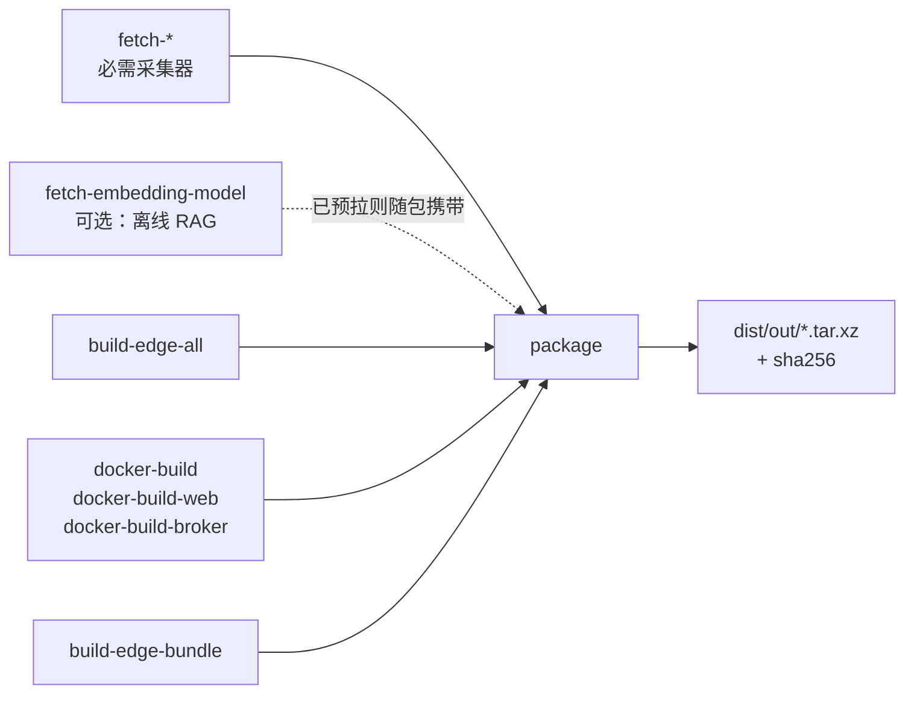

# Make & Makefile

> 根 `Makefile` 是 Ongrid 的统一工程入口：本地开发、CI、镜像构建和发布都应调用
> `make <target>`。它不是另一种 shell 脚本，而是一张“目标如何由依赖生成”的图。

## 核心概念

### 1. target、prerequisite、recipe

```make
.PHONY: build
build: build-ongrid build-ongrid-edge
	@echo "全部构建完成"
```

- `build` 是 **target**；
- `build-ongrid build-ongrid-edge` 是前置依赖；
- Tab 开头的命令是 **recipe**；
- Make 先完成依赖，再执行当前 target。

本仓库的 `build` 不自己编译代码，而是组合两个更小目标。这让 CI 和开发者使用同一个
入口，也能单独执行 `make build-ongrid`。

### 2. 为什么要 `.PHONY`

Make 原本面向文件生成：如果磁盘上恰好有一个名为 `test` 的文件，它可能认为
目标已经是最新的而跳过命令。命令型目标要声明：

```make
.PHONY: test
test:
	go test ./...
```

内部辅助目标也应声明 phony。本仓库 `_compose-certs` 以 `_` 表示内部目标，
没有 `##` 帮助注释，因此不会出现在 `make help`。

### 3. 变量与覆盖

```make
VERSION := $(shell cat VERSION)
TARGET_ARCH ?= amd64
```

| 写法 | 含义 |
|------|------|
| `:=` | 立即求值一次 |
| `=` | 使用时再递归展开 |
| `?=` | 仅在变量未定义时给默认值 |
| `$(NAME)` | Make 变量引用 |
| `$$name` | recipe 中传给 shell 的 `$name` |

`?=` 让调用方可以覆盖默认值：

```bash
make package TARGET_ARCH=arm64
make docker-build PLATFORM=linux/arm64
make package VERSION=v0.8.5
```

命令行变量优先级高于 Makefile 中的普通赋值和默认值。环境变量通常会被 Makefile 的
普通 `:=` / `=` 覆盖，因此本仓库统一推荐 `make target NAME=value`，也方便日志复现。

### 4. 每行 recipe 默认是独立 shell

这是最容易踩的 Make 坑：

```make
bad:
	cd web
	npm run build   # 已回到原目录

good:
	cd web && npm run build
```

多步逻辑要写在同一 recipe 行，用 `\` 续行和 `&&` / `;` 连接；复杂到难读时应移到
`scripts/`，Makefile 只保留入口。

### 5. `@`、退出码与失败传播

- recipe 默认先打印命令再执行；
- 前缀 `@` 只隐藏命令文本，不隐藏程序输出；
- 任一步返回非零，Make 会停止当前依赖链；
- 不要用 `|| true` 掩盖真实失败，除非失败确实是可接受分支并有说明。

例如 `_compose-certs` 先检查 `openssl`，缺失就明确报错并退出，而不是让 nginx
稍后以“证书不存在”进入重启循环。

## 在本仓库

### target 分组

根 Makefile 按职责分段：

| 分组 | 常用 target | 作用 |
|------|-------------|------|
| 发现入口 | `help` | 从 `##` 注释生成目标清单 |
| 本地构建 | `build`、`build-ongrid`、`build-ongrid-edge` | 输出到 `bin/`，注入版本号 |
| 质量门禁 | `test`、`test-race`、`lint`、`arch-lint` | 单测、竞态、lint、架构边界 |
| API | `proto` | 优先 buf，缺失时回退 protoc |
| 镜像 | `docker`、`docker-ongrid`、`docker-ongrid-edge` | 开发镜像 |
| 本地运行 | `compose-up`、`compose-down`、`run-*` | 启停依赖或直接运行二进制 |
| 发布构建 | `build-edge-all`、`docker-build*`、`fetch-*` | 多平台产物与第三方采集器 |
| 打包 | `package`、`package-all` | 生成自包含安装 tarball |
| 清理 | `clean`、`dist-clean` | 删除构建或发布产物 |

先运行：

```bash
make help
```

不要靠记忆猜 target，也不要在 CI / 文档里复制 target 内部的裸命令。统一入口的价值是：
版本参数、构建 flags 和依赖关系只维护一份。

### 版本注入

```make
VERSION  := $(shell cat VERSION 2>/dev/null || git describe ...)
LDFLAGS  := -X main.version=$(VERSION)
GO_BUILD := go build -trimpath -ldflags '$(LDFLAGS)'
```

`make build-ongrid` 最终把版本写进 `main.version`。排查“二进制来自哪次构建”时，
版本信息比文件时间可靠。发布 target 还用 `PLATFORM` / `TARGET_OS` /
`TARGET_ARCH` 计算产物目录和镜像平台。

### 发布依赖图



Make 的依赖图让 `make package` 自动按顺序准备输入。每个子目标仍可独立执行，
便于定位下载、交叉编译、镜像构建或归档中的具体失败。

| 想看什么 | 打开 |
|----------|------|
| 全部 target 与依赖 | 根目录 `Makefile` |
| 发布归档实现 | `dist/package.sh` |
| CI 如何调用 Make | `.github/workflows/` |
| 版本源 | `VERSION`、`.tool-versions` |
| 构建产物忽略规则 | `.gitignore` |

## 实用指引

```bash
# 只打印将执行的命令，不真正执行
make -n build-ongrid

# 调试变量值
make version-print
make -pn | grep '^TARGET_ARCH '

# 强制忽略时间戳重新执行目标
make -B build-ongrid

# 并行执行彼此独立的依赖
make -j2 build
```

日常工作流：

```bash
make compose-up
make test
make test-race
make build
```

改不同区域时：

```bash
make proto                         # 修改 api/*.proto 后
make docker-ongrid VERSION=dev     # 重建 compose 使用的 manager:dev
make docker-build-web VERSION=dev  # 重建 compose 使用的 web:dev
make package TARGET_ARCH=arm64     # 单架构发布包
make package-all                   # amd64 + arm64
```

新增公开 target 的约定：

```make
.PHONY: check-example
check-example: ## 检查 example 配置
	./scripts/check-example.sh
```

名称用 kebab-case、动词开头，公开 target 带 `## 中文说明`；辅助目标不加帮助注释。
target 应封装完整动作，调用者不需要知道内部用了 `go build`、`docker buildx`
还是 shell 脚本。

## 坑位提醒

- recipe 必须以 **Tab** 开头，空格会报 `missing separator`；
- Make 变量是 `$(VAR)`，shell 变量在 recipe 中要写 `$$var`；
- 覆盖 `VERSION` 应写 `make package VERSION=vX`；仅写环境前缀可能被 Makefile 赋值覆盖；
- `make clean` / `make dist-clean` 会删产物，执行前确认是否有未归档结果；
- `make -j` 只适合依赖关系声明完整的目标；共享同一输出目录的 recipe 可能互相覆盖；
- 不要让 target 依赖当前 shell 已经 `cd` 到某目录，路径统一以仓库根目录为基准；
- 文档和 CI 应调用 Make target。直接复制内部命令会绕过版本注入、缓存参数或前置检查。

## 学习资料

- [GNU Make Manual · Introduction](https://www.gnu.org/software/make/manual/html_node/Introduction.html)
- [GNU Make Manual · Rules](https://www.gnu.org/software/make/manual/html_node/Rules.html)
- [GNU Make Manual · Variables](https://www.gnu.org/software/make/manual/html_node/Using-Variables.html)
- [Makefile Tutorial](https://makefiletutorial.com/)（适合快速建立心智模型）
