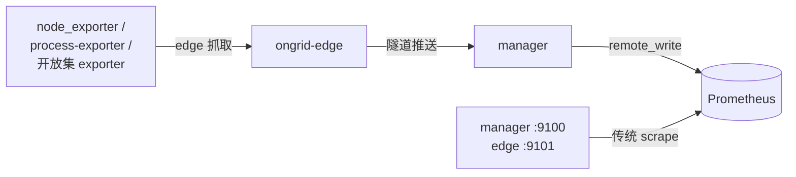

# Prometheus & PromQL（含 Grafana）

> 指标这条线既是**产品功能**（agent 替用户写 PromQL、监控面板）也是**自身监控**
> （manager/edge 暴露 /metrics）。不懂 PromQL 没法改 monitor/metric/alert 子域。

## 核心概念

### 1. 数据模型：带标签的时间序列

```
node_cpu_seconds_total{edge_id="42", mode="idle"}  →  (t1,v1) (t2,v2) ...
```

一条序列 = 指标名 + label 组合。**label 基数 = 序列数 = 成本**，
所以红线规定 user_id / email / url 这类高基数字段禁止做 label。

### 2. 四种指标类型

| 类型 | 语义 | 例 |
|------|------|----|
| Counter | 只增不减的累计值，看**速率**才有意义 | 请求总数 |
| Gauge | 瞬时值，可升可降 | 内存占用 |
| Histogram | 分桶分布，可算分位 | 请求耗时 |
| Summary | 客户端侧分位（少用） | — |

### 3. PromQL 高频句式

```promql
# Counter 必配 rate：近 5 分钟每秒 CPU 非空闲占比
1 - avg by (edge_id) (rate(node_cpu_seconds_total{mode="idle"}[5m]))

# Gauge 直接用：内存使用率
1 - node_memory_MemAvailable_bytes / node_memory_MemTotal_bytes

# 聚合：sum / avg / max / topk + by/without
topk(5, rate(process_cpu_seconds_total[5m]))

# Histogram 分位
histogram_quantile(0.99, sum by (le) (rate(http_request_duration_seconds_bucket[5m])))
```

记三条规则就能读懂大部分查询：counter 先 `rate()`；`[5m]` 是回看窗口；
`by (x)` 决定聚合后保留哪些 label。

### 4. 采集路径（本项目特有）



被管主机的指标**不是** Prometheus 直接 scrape 的（主机不开端口），
而是 edge 推送 → manager `remote_write` 写入。只有 manager 自身指标走传统 scrape
（`deploy/prometheus/prometheus.yml`）。

### 5. Grafana

只读消费者：datasource 指向 Prometheus（uid `ongrid-prometheus`），
预置「服务器详情」dashboard（变量 `edge_id`）。生产栈里 Grafana 不直接暴露，
经 nginx `/grafana/` 反代并复用 ongrid 会话鉴权。

## 在本仓库

| 想看什么 | 打开 |
|----------|------|
| 查询封装（agent 的 query_promql 也走它） | `internal/pkg/promquery` |
| remote_write 写入 | `internal/pkg/promwrite`、`manager/biz/promwrite` |
| 自身指标暴露 | `internal/pkg/prom`、`pkg/httpserver` |
| LLM 指标的 label 红线示例 | `internal/pkg/llm/metrics.go` |
| Grafana 集成 | `internal/pkg/grafana`、`manager/biz/grafana` |

## 实用指引

```bash
# 本地栈直接玩
open http://localhost:9090        # Prometheus UI：先在 Graph 页练 PromQL
open http://localhost:3000        # Grafana（admin/admin）

# API 查询（agent 工具同款路径）
curl -s 'localhost:9090/prometheus/api/v1/query?query=up' | jq

# 看某个 edge 有没有数据进来
curl -s 'localhost:9090/prometheus/api/v1/series?match[]={edge_id="42"}' | jq | head
```

给代码加指标的套路（自观测）：在包内定义 collector，`init()` 注册
（这是 `init()` 被允许的少数用途），label 只用低基数维度，命名遵循
`<组件>_<名词>_<单位>[_total]`。

## 学习资料

- [Prometheus 官方 · Concepts](https://prometheus.io/docs/concepts/data_model/)
- [PromQL for Humans](https://timber.io/blog/promql-for-humans/)（最好的入门文）
- [Grafana 文档 · Dashboards](https://grafana.com/docs/grafana/latest/dashboards/)
