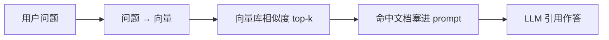

# RAG、嵌入与 Qdrant

> 知识库（`biz/knowledge`）的底座：文档/代码向量化存入 Qdrant，
> agent 用 `query_knowledge` / `code_source` 语义检索后引用作答。

## 核心概念

### 1. RAG（Retrieval-Augmented Generation）

不微调模型，而是「先检索、后生成」：



价值：知识可即时更新、可溯源（答案能指回原文档）、私有数据不出域。

### 2. 嵌入（embedding）

把文本映射成定长浮点向量，**语义相近 → 向量距离近**。
相似度一般用余弦。两个工程事实：

- 同一个库里**必须用同一个嵌入模型**——不同模型的向量空间不可比，
  换模型 = 全量重嵌入；
- 本仓库默认**本地 ONNX 跑 BGE 模型**（fastembed-go），离线可用——这就是云端
  镜像带 cgo/glibc 的原因；也可切云端嵌入 API（`ONGRID_EMBEDDING_PROVIDER`）。

### 3. chunk（切块）

长文档整篇嵌入会稀释语义，所以切块后逐块嵌入：

- 本仓库上传文件（upload 来源）会 chunk，同一文件的所有 chunk 共享同一个
  `url` 身份（编辑/移动 = 按 url 删旧重嵌）；
- 检索命中的是 chunk，列表/详情按 url 聚合回「一篇文档」。

### 4. Qdrant 速览

向量数据库，基本对象：

| 概念 | 含义 | 本仓库 |
|------|------|--------|
| collection | 表（固定向量维度 + 距离函数） | `CollectionName`（knowledge） |
| point | 一条记录：id + 向量 + payload | doc id = md5 派生 uint64 |
| payload | 任意 JSON 元数据，可过滤 | **正文就存这里**（title/content/path/tags…） |
| filter | 检索时的结构化过滤 | path_prefixes 精确匹配做目录树过滤 |

两个本仓库特有的坑（代码注释里都有据可查）：

- point id 是全量 uint64，**qdrant 的 filter 解析器拒绝 > int64 的值**——
  所以按 id 查走 `GetPoints`（POST /points）而不是 filter；
- 前端把 id 当 **string** 处理（JSON `uint64 + ,string` tag），防 JS 2^53 溢出；
- 目录前缀过滤不用全文索引（分词太松），而是把 `网络/DNS/排查` 预展开成
  `["网络","网络/DNS","网络/DNS/排查"]` 存进 payload 做 keyword 精确匹配。

## 在本仓库

| 想看什么 | 打开 |
|----------|------|
| 入库/检索/CRUD 主流程 | `internal/manager/biz/knowledge/usecase.go` |
| qdrant 客户端封装 | `internal/pkg/qdrantx` |
| 嵌入封装（本地/云端） | `internal/pkg/embedding` |
| 文档抽取（pdf/docx → 文本） | `internal/pkg/docextract` |
| 内置 vault 快照 | `biz/knowledge/builtin_vault/`（embed.FS） |
| agent 检索工具 | `aiops/tools/query_knowledge_basetool.go` |
| 代码仓库检索 | `biz/knowledge/code_browse.go` + SSH identity（`ssh_identity.go`） |

## 实用指引

```bash
# 看 collection 状态（本地栈 qdrant 未映射端口，进容器）
docker exec ongrid-qdrant sh -c \
  'wget -qO- http://localhost:6333/collections' | head -c 400

# 离线包要带嵌入模型：发版前一次性
make fetch-embedding-model
```

- 检索效果差先查三件事：① 嵌入 provider 配了吗（没配则 usecase 返回
  ErrNotWiredYet）② 文档真的入库了吗（Web 知识库页计数）③ 查询语言与文档语言
  是否差太远（BGE 中英都行，但术语写法影响召回）；
- Web 知识库页的「检索」框 = `query_knowledge` 工具同款调用，调参（path 过滤、
  limit）最方便的试验台；
- 改 chunk / 嵌入逻辑是**全量重建级**变更：老向量与新逻辑不一致，
  要提供重新同步路径（vault sync / repo sync / 上传重嵌）。

## 学习资料

- [Qdrant 文档 · Quickstart](https://qdrant.tech/documentation/quickstart/)
- [BGE 模型](https://huggingface.co/BAAI/bge-small-zh-v1.5)（本仓库默认嵌入模型家族）
- 任意一篇 "RAG from scratch" 教程（机制 10 分钟就能懂，工程化坑在上文）
