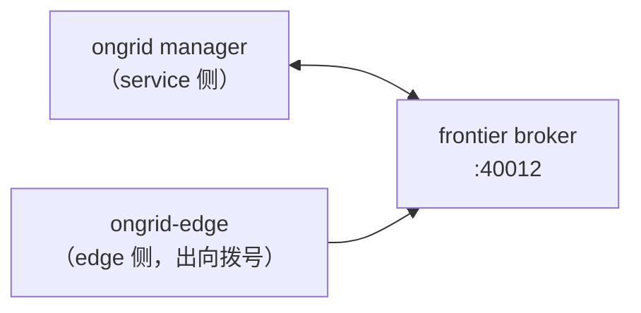

# geminio 隧道 & frontier broker

> 「零入站端口」是产品核心卖点：被管主机不开 22/80/443，edge **主动拨出**
> 一条长连接，之后云端对主机的一切操作都骑在这条连接上反向进行。

## 为什么这样设计

传统 agent 方案要么要求主机开端口（安全审计噩梦），要么轮询拉取（实时性差）。
出向长连接 + 多路复用让云端能「像调本地函数一样」调主机上的工具，
而主机防火墙规则一条都不用改——企业内网、NAT 后的机器都能接入。

## 核心概念

### 1. 三方角色



- **frontier**（上游开源 `singchia/frontier`，ADR-007）：中继/会议室。
  自己不懂业务，只负责把 service 侧和 edge 侧的流接起来；
- **geminio**（同作者的库）：在一条 TCP 连接上提供**多路复用 + 双向 RPC**
  ——任一侧都能向对侧发起请求，这是「云端反向调用主机」的机制基础。

### 2. RPC over 隧道

edge 启动时注册一组 handler（方法名 → 函数），云端按 edge id 寻址调用：

```
云端: call(edgeID, "get_host_load", req) ──tunnel──▶ edge: handler 执行 ──▶ 返回
```

- 消息载荷用 proto 序列化（`api/tunnel/v1/tunnel.proto`），**不是 gRPC**；
- agent 的主机侧工具（host_load / host_files / bash / execute_skill）全是这个形状；
- WebShell 则是在隧道上开**流**（PTY 字节流），而非一问一答 RPC。

### 3. 认证与生命周期

- edge 用注册时下发的 **AK/SK** 拨号认证（与用户 JWT 体系无关）；
- 上线/掉线事件回调到 `manager/biz/edge`，驱动设备在线状态；
- 断线重连是 edge 的责任（拨号方永远是 edge）。

### 4. 指标反向流

主机指标不走「云端来拉」：edge 采集（node_exporter / gopsutil）→ 经隧道推给
manager → manager `remote_write` 写进 Prometheus。所以 Prometheus 配置里
没有每台主机的 scrape job——主机数量变化不需要改 Prometheus。

## 在本仓库

| 想看什么 | 打开 |
|----------|------|
| 隧道封装（两侧共用） | `internal/pkg/tunnel` |
| edge 侧 handler 注册 | `internal/edgeagent/service`、`cmd/ongrid-edge/main.go` |
| 云端调用方 | `internal/manager/biz/edge`、aiops 工具的 host_* 系列 |
| 消息契约 | `api/tunnel/v1/tunnel.proto` |
| WebShell 流 | `internal/edgeagent/webshell` + `manager/biz/webshell` |
| broker 部署 | `deploy/docker-compose.yml` 的 `frontier` 服务、`Dockerfile.frontier` |

## 实用指引

- 本地起一个 edge 连 compose 栈：Web「Devices」页生成安装命令；纯本机调试可
  `make run-ongrid-edge`（环境变量给 AK/SK 和 server 地址，见
  `docs/install/edge.md`）；
- 排查 edge 不在线：先看 frontier 容器日志，再看 edge 侧
  `journalctl -u ongrid-edge`（systemd 安装）；
- 新增一个主机侧 RPC：edge 侧 `edgeagent/service` 注册 handler →
  云端封装调用 → 若给 agent 用再包成 basetool。**任何主机侧执行能力都要过
  `edgeagent/cmdpolicy` 评审并接审计**；
- 隧道消息要加字段：改 `api/tunnel/v1/tunnel.proto`，注意新旧版本 edge 会
  长期共存（升级是逐台滚动的，ADR-024），字段必须向后兼容。

## 学习资料

- [singchia/geminio](https://github.com/singchia/geminio)、
  [singchia/frontier](https://github.com/singchia/frontier) README
- 概念类比：frp / ngrok 的反向隧道，加上双向 RPC 语义
